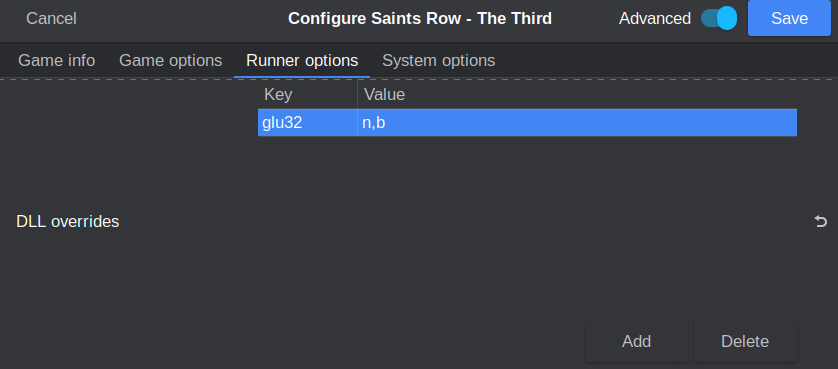
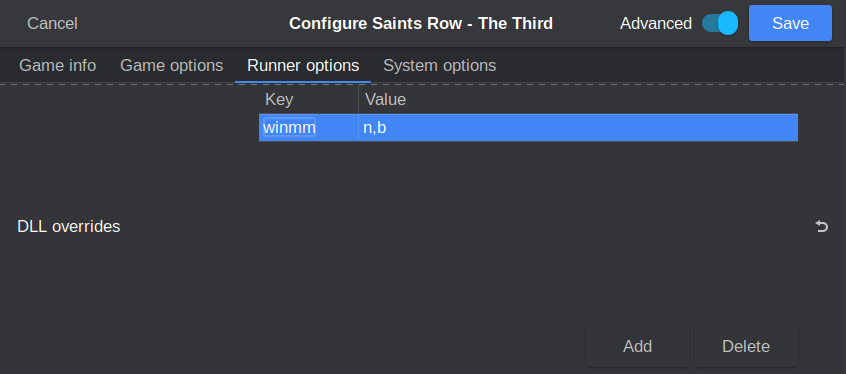

# **CEG (Steam Custom Executable Generation)**

This is Valve's attempt at a non-trivial DRM. When you download a game from Steam that has CEG enabled, Steam will generate a unique EXE just for you. The easiest way to defeat CEG is through LumaCEG. LumaCEG can be found in cs.rin's `Main Forum -> Releases` section (thread ID `64354`). The important files to grab here are the x86 and x64 plugins, but grabbing the main injection file as well is a good idea for your toolkit. Defeating CEG with LumaCEG has two stages:

1. A legitimate owner of the game must inject LumaCEG into their Steam client, so that the CEG EXE will be anonymized at download time from Steam. This EXE can then be shared with others.

2. A user will take an anonymized EXE, then inject the LumaCEG dll into the game at runtime, auto-defeating CEG

Stage 1 requires a Windows installation of Steam, because LumaCEG's injection method was never replicated for Steam on Linux. I personally don't like the idea of hacking into a running Steam client to create these EXEs from my legitimate games, because I don't want to get unlucky and have my Steam account be banned for tampering. Luckily, anyone can create and upload these anonymized EXEs, and CEG is old tech that was only used on ~100 games ever, so I prefer to use the ones that others have generated instead. You can find a thread full of these EXEs on cs.rin with the title "Collection of LumaCEG Binaries" (thread ID `71822`). If you'd rather not rely on others and want to generate your own anonymized EXEs that is also a great option.

Stage 2 requires LumaCEG to be injected into the game at runtime. Thankfully, there's a project named [Koaloader](https://github.com/acidicoala/Koaloader) that makes this a lot easier. Grab the latest version of this for your toolkit.

# Cracking Guide

For our walkthrough we'll be cracking the CEG DRM on the Windows version of "Saints Row - The Third" (hereafter referred to as `SRTT` for my sanity). This game is easy to source via cs.rin's SCS (thread ID `55978`). SRTT is protected with CEG and Steamworks API.

1. Source SRTT and extract it to your workspace

2. Defeat [Steamworks API](../Steamworks-API/defeating_steamworks.md) protection (this will usually be present on a game if CEG is present)

3. Source SRTT's anonymized CEG EXEs (read the intro of this page if you're lost)

4. Overwrite `SaintsRowTheThird.exe` and `SaintsRowTheThird_DX11.exe` with the two new anonymized EXEs

5. Since SRTT is 32-bit, we'll copy `LumaCEG_Plugin_x86.dll` and `LumaCEGPlugin.ini` from LumaCEG into the SRTT directory

6. Now LumaCEG is ready to auto-defeat CEG, but it needs to get injected into the runtime first. To inject LumaCEG, we're going to use a general purpose injection tool named Koaloader. Refer to the [Koaloader Guide](../../Tools/Koaloader/koaloader.md) for more information on how this tool works.


7. At this point, we need to determine which Koaloader DLL the game will reach out and grab. Since SRTT is a 32-bit game, we'll use 32-bit Koaloader DLLs. As a first try, let's use `glu32.dll`.

8. Copy `glu32.dll` from the `glu32-32` Koaloader folder into the SRTT directory.

9. Copy `Koaloader.config.json` from Koaloader's root folder into the SRTT directory, and edit the configuration so it reads as follows:

    ```json
    {
    "logging": true,
    "enabled": true,
    "auto_load": false,
    "targets": [
        "SaintsRowTheThird.exe",
        "SaintsRowTheThird_DX11.exe"
    ],
    "modules": [
        {
        "path": "LumaCEG_Plugin_x86.dll",
        "required": true
        }
    ]
    }
    ```

10. Koaloader is almost ready to be injected, but since we're using Wine, we need to tell Wine to leave our DLL alone. By default, Wine hijacks some DLLs that load and replaces them with its own versions at runtime. We're going to explicitly tell Wine that if it sees our DLL, it should let it load without interfering. If it doesn't see the DLL we specify, then it will try to load its own DLL as normal.

11. We can inform Wine of this configuration by using Lutris. If you use another tool, there should be a section somewhere for this, or worst-case you can use the `WINEDLLOVERRIDES` environment variable. To do this in Lutris, open your game's configuration and navigate to `Runner Options` -> `DLL Overrides`. Input `glu32` as a key and `n,b` as a value. `n,b` stands for "Native, then Built-in", aka Wine should preferentially let the game's local DLL load if available, or fallback to the Built-in Wine version if it's not.

    

12. Now Koaloader is ready to be injected the next time the game runs.

13. Start SRTT and observe that nothing happens. At the very least, we're looking for a file named `Koaloader.log.log` to be created in the directory, which means that the game attempted to load our disguised DLL.

14. Back to the drawing board - let's try another DLL. You can pick whatever DLL variant you want to try next, but since I'm omniscient I know that one of the right answers for SRTT is `winmm.dll`. Other games will need other variants of Koaloader in order to work. The [Koaloader guide](../../Tools/Koaloader/koaloader.md) has a section on deterministically finding a DLL name, if you don't like guessing.

15. Delete `glu32.dll` from the directory and replace it with the 32-bit version of `winmm.dll` from Koaloader.

16. Replace our `glu32` DLL Override key with `winmm`

    

17. Start the game again. This time it launches! We can read `Koaloader.log.log` and see that the following happened:

    ```
    🟩│ 14:08:13.824 │ 206:koaloader.cpp            ┃ 🐨 Koaloader 📥 v3.0.2 | Compiled at 'Sat Jan 14 03:33:31 2023'
    ⬛│ 14:08:13.824 │ 209:koaloader.cpp            ┃ Executable path: "C:\Games\Saints Row the Third\SaintsRowTheThird_DX11.exe" [32-bit]
    ⬛│ 14:08:13.824 │ 210:koaloader.cpp            ┃ Current working directory: "C:\Games\Saints Row the Third"
    ⬛│ 14:08:13.824 │ 211:koaloader.cpp            ┃ Koaloader directory: "C:\Games\Saints Row the Third"
    ⬛│ 14:08:13.824 │  31:koaloader.cpp            ┃ Target found: 'SaintsRowTheThird_DX11.exe'
    ⬛│ 14:08:13.824 │ 136:koaloader.cpp            ┃ Beginning search in "C:\Games\Saints Row the Third"
    🟩│ 14:08:13.842 │  64:koaloader.cpp            ┃ ✅ Loaded module: "LumaCEG_Plugin_x86.dll"
    🟩│ 14:08:13.842 │ 227:koaloader.cpp            ┃ 🚀 Initialization complete

    ```

18. CEG is now defeated!


