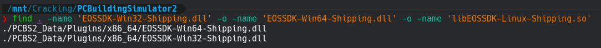
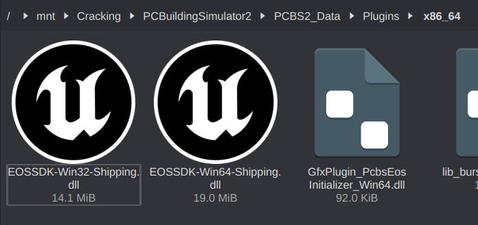
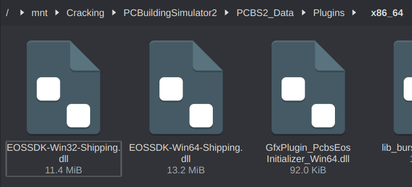
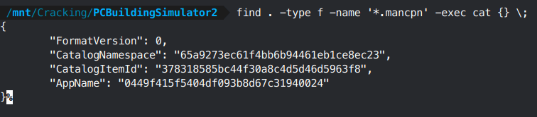
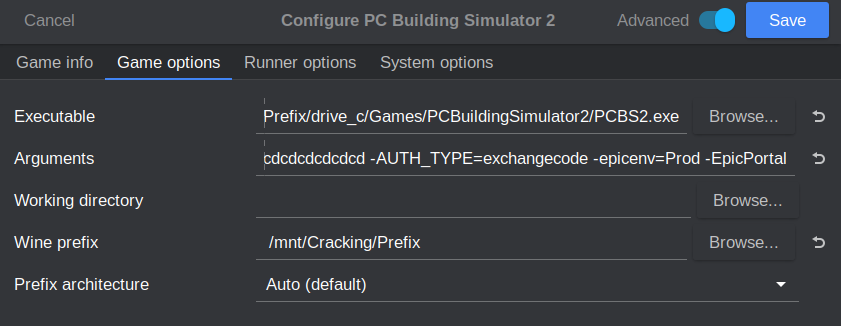

# **Epic Online Services**

This is a generic DRM applied to games sold on the Epic store. It's trivial to defeat using `Nemirtingas Epic Emulator`. You can find this emulator in cs.rin's `Main Forum -> Releases` section (thread ID `105551`). Download all versions of the emulator (win32, win64, linux64, mac64) and keep them in your toolkit.

I have the least amount of experience with this DRM because I don't have an Epic account. I would rather wait a year or two for games to come to Steam than give any business to Epic. Most people seem to be of the same opinion - it will be rare to find clean Epic copies of games when a Steam version also exists. If you want to do advanced configurations, you'll likely have to check the official thread for help. There aren't enough games worth testing on to really get a feel for this tool's intricacies.

# Cracking Guide

For our walkthrough we'll be cracking the EOS DRM on PC Building Simulator 2. This game should be easy to source through cs.rin via its dedicated game thread under `Main Forum -> Other Gaming Platforms` (thread ID `120407`). This game uses EOS and EOS must also be configured properly for it to start, so it's a good sanity check that everything is working properly.

1. Source PC Building Simulator 2 and extract it to your workspace

2. Open a terminal in the base game directory and run the following command to locate the EOS libraries: `find . -type f | grep -E EOSSDK-Win32-Shipping.dll\|EOSSDK-Win64-Shipping.dll\|libEOSSDK-Linux-Shipping.so`

    

3. Navigate to those EOS DLLs and replace each one with its emulator equivalent

    

    

4. Open a terminal in the base game directory and run the following command to find and print the game's store information (normally located in the `.mancpn` file in the `.egstore` folder): `find . -type f -name '*.mancpn' -exec cat {} \;`

    

5. Now we're going to build out some information so we can configure the emulator. Each item will later be combined into a launch option:

    Configurable:

    - `-epicusername="Yote.zip"` - Change to whatever you want your name to show up as ingame
    - `-epiclocale=en` - If you need a different language, pick a value from [this list](eos_languages.md)
    - `-epicsandboxid=65a9273ec61f4bb6b94461eb1ce8ec23` - This value comes from the CatalogNamespace in step 4. It needs to be changed for every game.
    - `-epicapp=0449f415f5404df093b8d67c31940024` - This value comes from the AppName in step 4. It needs to be changed for every game.
    - `-epicuserid=aaaaaaaaaaaaaaaaaaaaaaaaaaaaaaaa` - This value doesn't normally need to be changed, but if you're playing LAN with someone you'll need to have a different ID than them

    Always the same:

    - `-AUTH_LOGIN=unused`
    - `-AUTH_PASSWORD=cdcdcdcdcdcdcdcdcdcdcdcdcdcdcdcd`
    - `-AUTH_TYPE=exchangecode`
    - `-epicenv=Prod`
    - `-EpicPortal`

6. Combine all the pieces into one string:

       -epicusername="Yote.zip" -epiclocale=en -epicsandboxid=65a9273ec61f4bb6b94461eb1ce8ec23 -epicapp=0449f415f5404df093b8d67c31940024 -epicuserid=aaaaaaaaaaaaaaaaaaaaaaaaaaaaaaaa -AUTH_LOGIN=unused -AUTH_PASSWORD=cdcdcdcdcdcdcdcdcdcdcdcdcdcdcdcd -AUTH_TYPE=exchangecode -epicenv=Prod -EpicPortal

7. Copy this string to Lutris's `Arguments` option (or whatever tool you are using):

    

8. EOS is now defeated!

- DLC will be unlocked automatically, but there are mechanisms to unlock them individually if a game doesn't cooperate with auto-unlocking. For more advanced features like achievements, the ingame overlay, LAN play, and JSON configuration, refer to the official cs.rin thread.

