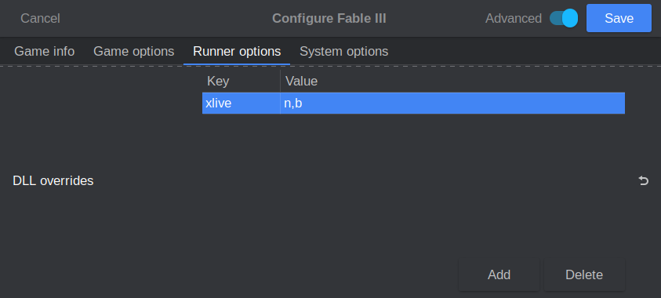
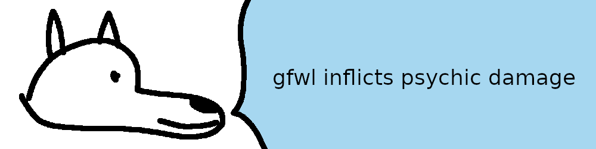

# **Games for Windows Live (GFWL)**

Any sufficiently terrible DRM is indistinguishable from malware. Not only does this one try to prevent pirates from playing, it's also notorious for causing an endless amount of issues for legitimate players. Luckily for us, GFWL is actually quite trivial to bypass. Unluckily for us, it's usually present around other annoying DRM from that time period, like Securom, so GFWL games still end up being a bit of a mess.

We're going to use a GFWL emulator from catspaw to defeat this DRM. You can find this emulator in cs.rin's `Main Forum -> Releases` section (thread ID `60668`). The most recent version (15d) of this emulator is on page 66 of this thread, posted by user machine4578. Grab this for your toolkit. I have not tested many GFWL games, but if you find that the catspaw emulator is not sufficient, feel free to try a few other emulators that are on page 74 of that thread, posted by user talos910. [xlivelessness](https://gitlab.com/GlitchyScripts/xlivelessness) also exists as an option.

# Cracking Guide

For our walkthrough we'll be cracking the GFWL DRM on Fable 3. This game is easy to source via cs.rin's SCS (thread ID `93457`). Fable 3 is infested with DRM, but so are most GFWL games. It's protected by Steamworks API, Securom, and GFWL.

1. Source Fable 3 and extract it to your workspace

2. [`FABLE 3 ONLY`] Winetricks `xact` is required for Fable 3 to run, otherwise it will crash after intro videos

3. [`FABLE 3 ONLY`] Defeat [Steamworks API](../Steamworks-API/defeating_steamworks.md) protection (remember that this is a DirectX9 game, so if you use Goldberg Experimental build you need to create a file named `steam_settings/disable_overlay.txt` or it will crash on Linux)

4. [`FABLE 3 ONLY`] Defeat [Securom](../Securom/defeating_securom.md) protection (we crack Fable 3 in the Securom guide as well)

5. Extract `xlive.dll` and `xlive.ini` from catspaw's GFWL emulator to your game directory.

6. Configure `xlive.ini`:

    - `profile name 1` - Change to whatever you want your name to show up as ingame

    - `online profile` - Toggle emulation of a fake "online" account, depending on the game

7. We're almost ready, but since we're using Wine, we need to tell Wine to leave our DLL alone. By default, Wine hijacks some DLLs that load and replaces them with its own versions at runtime. We're going to explicitly tell Wine that if it sees our DLL, it should let it load without interfering. If it doesn't see the DLL we specify, then it will try to load its own DLL as normal.

8. We can inform Wine of this configuration by using Lutris. If you use another tool, there should be a section somewhere for this, or worst-case you can use the `WINEDLLOVERRIDES` environment variable. To do this in Lutris, open your game's configuration and navigate to `Runner Options` -> `DLL Overrides`. Input `xlive` as a key and `n,b` as a value. `n,b` stands for "Native, then Built-in", aka Wine should preferentially let the game's local DLL load if available, or fallback to the Built-in Wine version if it's not.

    

9. GFWL is now defeated!

- If you want to unlock DLC for your game, you will likely have to read through your game's cs.rin thread. You need to source the physical DLC files and put them in a `DLC` folder in your game directory.

