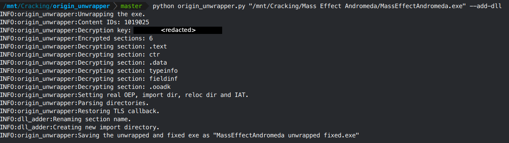
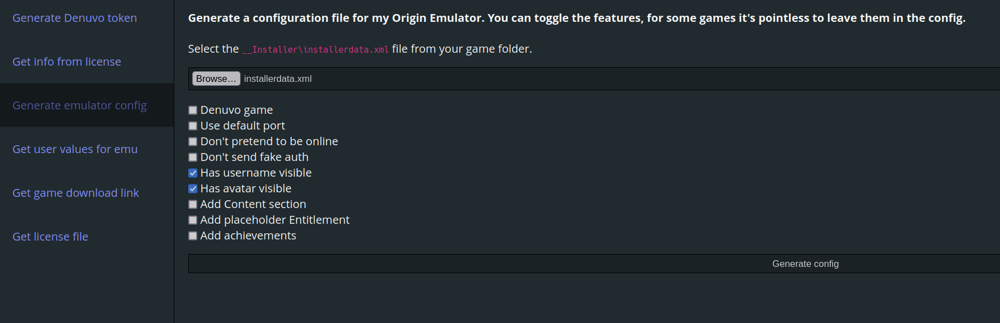
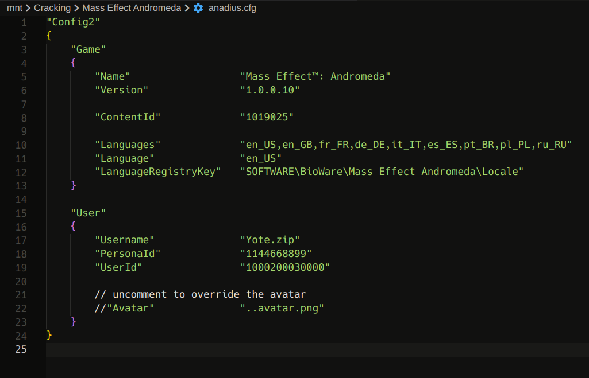
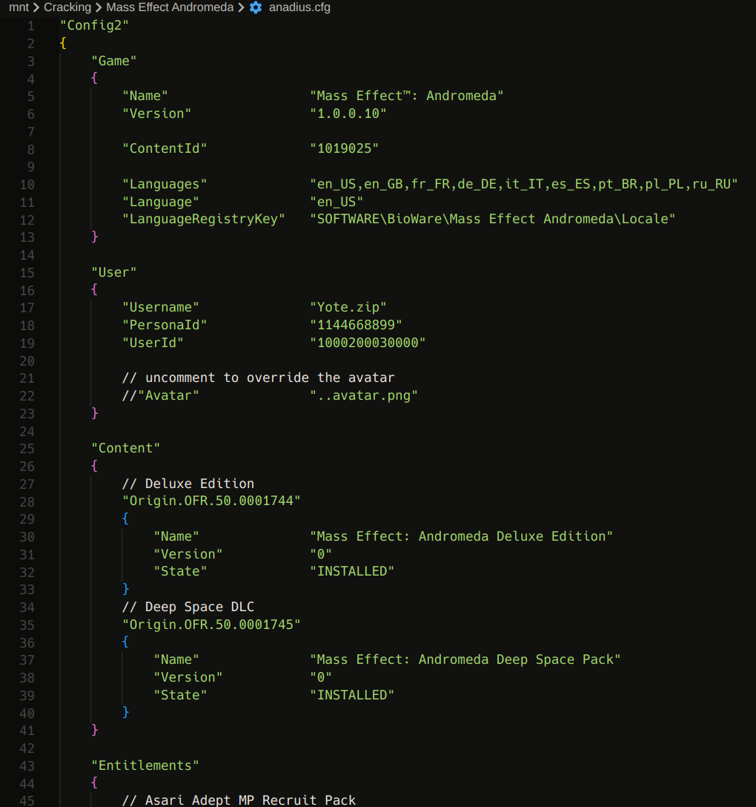

# **Origin (New)**

This is a generic DRM applied to games sold on the EA/Origin store, and sometimes to EA games on other stores. It's quite easy to defeat generically using Anadius's Origin Unwrapper and Emulator tools. The Origin Unwrapper tool can be found under `Main Forum -> Releases` (thread ID `125589`), and the Emulator can be found in the same forum (thread ID `115335`).

Download the Unwrapper, the Emulator, and the Emulator's configs/tools and keep them in your toolkit.

Origin encrypts certain parts of the EXE as a DRM, so we can't get in the middle to inject an emulator DLL. In order to circumvent this, we need to take three steps:

1. Decrypt the EXE using a static decryption key. For whatever reason, this key is the same for every copy of a certain game. Anadius's Unwrapper tool comes preloaded with keys for many games already, but if your game's key is not included in the Unwrapper's `data.yaml` you'll need to own the game in order to get a key. Once you own the game, you need to run the game once before trying to unwrap again.

2. Once the EXE is decrypted, we're able to add a DLL lookup to Anadius's Emulator to it. The Unwrapper tool is capable of doing this with its `--add-dll` option.

3. Dropping Anadius's Emulator next to the EXE will now cause the EXE to load the Emulator at runtime and be generically defeated.

Overall, Anadius's tools are great and easy to work with. They come with an easy Denuvo token system (so you can bypass Denuvo on any Origin game if someone who owns the game helps you generate a code) and a module allowing online functionality if you have an authorization token. Getting an authorization token normally requires owning the game, but it's commonly used with The Sims 4 since the base game is free. The biggest annoyance with Origin DRM is that Anadius's Emulator can't auto-unlock DLC, so you'll need to fill out the configuration manually.

# Cracking Guide

For our walkthrough we'll be cracking the Origin DRM on Mass Effect Andromeda (hereafter referred to as `MEA` for my sanity). This game is easy to source via cs.rin's SCS (thread ID `56017`), and only uses Origin DRM.

1. Source MEA and extract it to your workspace

2. Open a terminal in the toolkit folder where your Anadius Origin Unwrapper tool lives, and run `python origin_unwrapper.py "/path/to/MassEffectAndromeda.exe" --add-dll` to generate a patched EXE. Ignore the "MassEffectAndromedaTrial" EXE, these "trials" come with a lot of Origin games and I don't think they do anything

    

3. Rename the output `unwrapped fixed` file to its original EXE name and copy it to your MEA directory, replacing the original

4. Since MEA is a 64-bit game, copy `anadius64.dll` from Anadius's Emulator into the folder next to the EXE.

5. Open the `origin_helper_tools.html` file from Anadius Emulator's configs/tools  in a web browser, and navigate to the "Generate Emulator Config" section. This tool will auto-generate a template configuration for you to use

    

6. Click "Browse" and pick your `__Installer/installerdata.xml` file from the MEA directory

7. You can generally always select `Has username visible` and `Has avatar visible` just in case a game uses them somewhere. The rest don't really need to be touched unless your game is Denuvo or you want to try auto-generating achievements (doesn't always work)

8. Click "Generate config" and save it into your MEA directory

9. Edit the `anadius.cfg` file that you just saved:
    - `User.Username` - Change to whatever you want your name to show up as ingame
    - `User.Avatar` - Link to a png that you want to display as an avatar ingame

    

10. If you want DLC to be unlocked as well, you need to manually input the DLC info into `anadius.cfg`. Finding out which what identifiers a DLC uses is somewhat annoying unless you use Anadius's "EA DLC Unlocker" tool with logging enabled (I don't think this works on Linux). A half-measure is that you can download "EA DLC Unlocker" under `Main Forum -> Releases` (thread ID `104412`), and it includes a lot of DLC identifiers in its files already (`g_*.ini` files). Acidicoala also maintains a [large public list](https://github.com/acidicoala/public-entitlements/blob/main/origin/v1/entitlements.json) of them, but it's not fully complete ([local version here (potentially outdated)](Public_Entitlement_Codes.json)).

11. Because I'm omniscient I already know the MEA DLC identifiers. Add the following sections to your anadius.cfg:

    ```
	"Content"
	{
		// Deluxe Edition
		"Origin.OFR.50.0001744"
		{
			"Name"				"Mass Effect: Andromeda Deluxe Edition"
			"Version"			"0"
			"State"				"INSTALLED"
		}
		// Deep Space DLC
		"Origin.OFR.50.0001745"
		{
			"Name"				"Mass Effect: Andromeda Deep Space Pack"
			"Version"			"0"
			"State"				"INSTALLED"
		}
	}

	"Entitlements"
	{
		// Asari Adept MP Recruit Pack
		"Origin.OFR.50.0002288"
		{
			"Group"				"ME4PCOffers"
			"Version"			"0"
			"Type"				"DEFAULT"
			"EntitlementTag"	"ME4_MP_BOOSTERPACK1"
		}
		// Krogan Vanguard MP Recruit Pack
		"Origin.OFR.50.0002305"
		{
			"Group"				"ME4PCOffers"
			"Version"			"0"
			"Type"				"DEFAULT"
			"EntitlementTag"	"ME4_MP_BOOSTERPACK2"
		}
		// Salarian Infiltrator MP Recruit Pack
		"Origin.OFR.50.0002306"
		{
			"Group"				"ME4PCOffers"
			"Version"			"0"
			"Type"				"DEFAULT"
			"EntitlementTag"	"ME4_MP_BOOSTERPACK3"
		}
		// Turian Soldier MP Recruit Pack
		"Origin.OFR.50.0002307"
		{
			"Group"				"ME4PCOffers"
			"Version"			"0"
			"Type"				"DEFAULT"
			"EntitlementTag"	"ME4_MP_BOOSTERPACK4"
		}
	}
    ```

12. Your `anadius.cfg` should now look like this:

    

13. Origin is now defeated!

