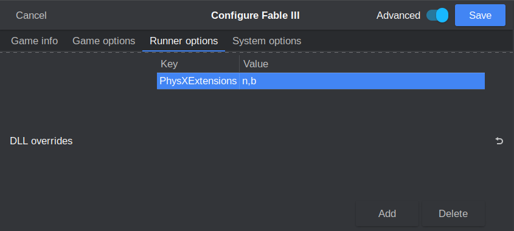

# **Securom**

Securom is quite an invasive DRM for legitimate players. There have been many controversies involving its malware-like tendencies - it's no surprise that Securom grew up to become Denuvo. It used to be commonly found on retail disc games, but most games have stripped it with the move to Steam et al. These days, you'll usually only find it on games that are sourced from retail disc releases or from games that forgot to take it out when moving to the digital marketplace.

Securom is moderately annoying to defeat, as it requires injecting a DLL into the game's runtime. Our cracking method utilizes an auto-defeat DLL made by virusek and NEOGAME, which can auto defeat Securom versions 7 and 8 (the most common kind). You can find this DLL posted by Christsnatcher on page 54 of the thread "RIN SteamInternals", stickied under cs.rin's `Main Forum` (thread ID `65887`). Download it and add it to your toolkit.

Another tool you may find useful for handling Securom is the "80_PA Universal Securom Keygen". This can be found in cs.rin's dedicated Fable 3 thread, posted on page 12 by arthurclg17 (thread ID `59454`). The auto-defeat DLL should be able to handle everything that this can, but the keygen is an almost equally powerful tool. We mostly prefer the DLL because it's stable and can be archived, whereas the keygen needs to generate different keys based on the system you're running it on.

# Cracking Guide

For our walkthrough we'll be cracking the Securom DRM on Fable 3. This game is easy to source via cs.rin's SCS (thread ID `93457`). Fable 3 is infested with DRM - it contains Steamworks API, Securom, and GFWL.

1. Source Fable 3 and extract it to your workspace

2. [`FABLE 3 ONLY`] Winetricks `xact` is required for Fable 3 to run, otherwise it will crash after intro videos

3. [`FABLE 3 ONLY`] Defeat [Steamworks API](../Steamworks-API/defeating_steamworks.md) protection (remember that this is a DirectX9 game, so if you use Goldberg Experimental build you need to create a file named `steam_settings/disable_overlay.txt` or it will crash on Linux)

4. [`FABLE 3 ONLY`] Defeat [GFWL](../GFWL/defeating_gfwl.md) protection (we crack Fable 3 in the GFWL guide as well)

5. In order to defeat Securom, we need to get the game to inject the virusek/NEOGAME Securom auto-defeat DLL. For more information on how DLL injection works, read the [Koaloader guide](../../Tools/Koaloader/koaloader.md). Koaloader isn't necessarily required to inject our DLL, since our DLL doesn't care what it's named. If you want to use Koaloader anyway, it will still work; this may be a good option if you want to chain in multiple other DLLs or if you want Koaloader's logging feature. Its default name is `iphlpapi.dll`, which is a good first name to try. Other good names to try are e.g. `gameservices.dll` or `PhysXExtensions.dll`, and any of the DLL names in the [Koaloader guide](../../Tools/Koaloader/koaloader.md). The [Koaloader guide](../../Tools/Koaloader/koaloader.md) also has a section on deterministically finding a DLL name, if you don't like guessing.

6. Copy the Securom auto-defeat DLL to the game folder. We'll try renaming it to `PhysXExtensions.dll` to see if the game pulls it in.

7. The DLL is almost ready to be injected, but since we're using Wine, we need to tell Wine to leave our DLL alone. By default, Wine hijacks some DLLs that load and replaces them with its own versions at runtime. We're going to explicitly tell Wine that if it sees our DLL, it should let it load without interfering. If it doesn't see the DLL we specify, then it will try to load its own DLL as normal.

8. We can inform Wine of this configuration by using Lutris. If you use another tool, there should be a section somewhere for this, or worst-case you can use the `WINEDLLOVERRIDES` environment variable. To do this in Lutris, open your game's configuration and navigate to `Runner Options` -> `DLL Overrides`. Input `PhysXExtensions` as a key and `n,b` as a value. `n,b` stands for "Native, then Built-in", aka Wine should preferentially let the game's local DLL load if available, or fallback to the Built-in Wine version if it's not.

    

9. Launch the game and you'll be greeted with an error message. Looks like the game isn't interested in loading that DLL.

10. Back to the drawing board - let's try another DLL. You can pick whatever DLL name you want to try next, but since I'm omniscient I know that one of the right answers for Fable 3 is `iphlpapi.dll`. Other games might need other DLL names in order to work.

11. Rename the DLL to `iphlpapi.dll` and switch our `PhysXExtensions` DLL Override key to `iphlpapi` instead.

    

12. Start the game again. This time it launches!

13. Securom is now defeated!

