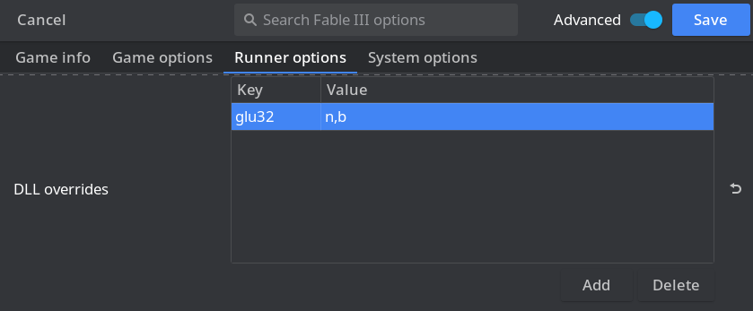

# **Securom**

Securom is quite an invasive DRM for legitimate players. There have been many controversies involving its malware-like tendencies - it's no surprise that Securom grew up to become Denuvo. It used to be commonly found on retail disc games, but most games have stripped it with the move to Steam et al. These days, you'll usually only find it on games that are sourced from retail disc releases or from games that forgot to take it out when moving to the digital marketplace.

Securom is moderately annoying to defeat, as it requires injecting a DLL into the game's runtime. Our cracking method utilizes an auto-defeat DLL made by virusek and NEOGAME, which can auto defeat Securom versions 7 and 8 (the most common kind). You can find this DLL posted by Christsnatcher on page 54 of the thread "RIN SteamInternals", stickied under cs.rin's `Main Forum` (thread ID `65887`). Download it and add it to your toolkit, and rename it to something descriptive so you don't forget what it is - e.g. mine is named `disablesecurom.dll`.

Another tool you may find useful for handling Securom is the "80_PA Universal Securom Keygen". The auto-defeat DLL should be able to handle everything that this can, but the keygen is an almost equally powerful tool. We mostly prefer the DLL because it's stable and can be archived, whereas the keygen needs to generate different keys based on the system you're running it on. There's a [GitHub repo](https://github.com/Blaukovitch/80_PA) available for this keygen with the latest releases attached, but the source code is not available. In order to use the keygen through Wine, you'll need to run `winetricks mfc42` in the prefix that you're launching the tool from. It's worth noting that all releases of this keygen come with what is effectively a complete technical manual to how Securom breaking works - just in case you're wild enough to write your own open-source version.

# Cracking Guide

For our walkthrough we'll be cracking the Securom DRM on Fable III. This game is easy to source via cs.rin's Main Forum (thread ID `59454`), or you can follow along with your own Securom-protected game. Fable III is infested with DRM - it contains Steamworks API, Securom, and GFWL.

1. Source Fable III and extract it to your workspace

2. [`Fable III ONLY`] Winetricks `xact` is required for Fable III to run, otherwise it will crash after intro videos

3. [`Fable III ONLY`] Defeat [Steamworks API](../Steamworks-API/defeating_steamworks.md) protection (remember that this is a DirectX9 game, so if you use Goldberg Experimental build you need to disable the overlay or it may crash on Linux)

4. [`Fable III ONLY`] Defeat [GFWL](../GFWL/defeating_gfwl.md) protection (we crack Fable III in the GFWL guide as well)

5. In order to defeat Securom, we need to get the game to inject the virusek/NEOGAME Securom auto-defeat DLL. To do this, we're going to use a general purpose injection tool named Koaloader. Refer to the [Koaloader Guide](../../Tools/Koaloader/koaloader.md) for more information on how this tool works.

6. To start, we'll copy our Securom auto-defeat DLL into the game directory, and take note of its name.

7. Next, we need to determine which Koaloader DLL the game will reach out and grab. Since Fable III is a 32-bit game, we'll use 32-bit Koaloader DLLs. As a first try, let's use `glu32.dll`.

8. Copy `glu32.dll` from the `glu32-32` Koaloader folder into the Fable III directory.

9. Copy `Koaloader.config.json` from Koaloader's root folder into the Fable III directory, and edit the configuration so it reads as follows (change the module to your DLL's name):

    ```json
    {
        "logging": true,
        "enabled": true,
        "auto_load": false,
        "targets": [
            "FableLauncher.exe",
            "F3Secu.exe",
            "Fable3.exe"
        ],
        "modules": [
            {
                "path": "disablesecurom.dll",
                "required": true
            }
        ]
    }
    ```

10.  Koaloader is almost ready to be injected, but since we're using Wine, we need to tell Wine to leave our DLL alone. By default, Wine hijacks some DLLs that load and replaces them with its own versions at runtime. We're going to explicitly tell Wine that if it sees our DLL, it should let it load without interfering. If it doesn't see the DLL we specify, then it will try to load its own DLL as normal.

11. We can inform Wine of this configuration by using Lutris. If you use another tool, there should be a section somewhere for this, or worst-case you can use the `WINEDLLOVERRIDES` environment variable. To do this in Lutris, open your game's configuration and navigate to `Runner Options` -> `DLL Overrides`. Input `glu32` as a key and `n,b` as a value. `n,b` stands for "Native, then Built-in", aka Wine should preferentially let the game's local DLL load if available, or fallback to the Built-in Wine version if it's not.

    

12. Now Koaloader is ready to be injected the next time the game runs.

13. Start Fable III and observe that we still get the Securom activation window. At the very least, we're looking for a file named `Koaloader.log.log` to be created in the directory, which means that the game attempted to load our disguised DLL.

14. Back to the drawing board - let's try another DLL. You can pick whatever DLL variant you want to try next, but since I'm omniscient I know that one of the right answers for Fable III is `version.dll`. Other games will need other variants of Koaloader in order to work. The [Koaloader guide](../../Tools/Koaloader/koaloader.md) has a section on deterministically finding a DLL name, if you don't like guessing.

15. Delete `glu32.dll` from the directory and replace it with the 32-bit version of `version.dll` from Koaloader.

16. Replace our `glu32` DLL Override key with `version`

    

17. Start the game again. This time it launches! We can read `Koaloader.log.log` and see that the following happened:

    ```
    🟩│ 13:20:53.224 │ 206:koaloader.cpp            ┃ 🐨 Koaloader 📥 v3.0.2 | Compiled at 'Sat Jan 14 03:31:08 2023'
    ⬛│ 13:20:53.224 │ 209:koaloader.cpp            ┃ Executable path: "C:\Games\Fable III\Fable3.exe" [32-bit]
    ⬛│ 13:20:53.224 │ 210:koaloader.cpp            ┃ Current working directory: "C:\Games\Fable III"
    ⬛│ 13:20:53.224 │ 211:koaloader.cpp            ┃ Koaloader directory: "C:\Games\Fable III"
    ⬛│ 13:20:53.224 │  31:koaloader.cpp            ┃ Target found: 'Fable3.exe'
    ⬛│ 13:20:53.224 │ 136:koaloader.cpp            ┃ Beginning search in "C:\Games\Fable III"
    🟩│ 13:20:53.252 │  64:koaloader.cpp            ┃ ✅ Loaded module: "disablesecurom.dll"
    🟩│ 13:20:53.252 │ 227:koaloader.cpp            ┃ 🚀 Initialization complete

    ```

18. Securom is now defeated!


