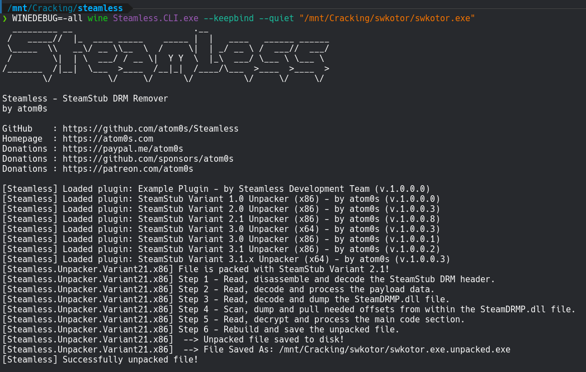
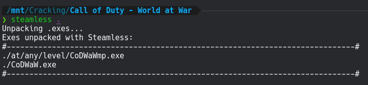

# **SteamDRM / SteamStub (Windows)**

This is a very basic DRM from Valve that wraps around an EXE. It's primarily found on older games, but sometimes new games still come out with this wrapped around. I don't know why a developer would even bother in modern times.

It is trivially unwrapped by a tool named [Steamless](https://github.com/atom0s/Steamless). Grab the latest release and put it in your toolkit. Steamless is a Windows application, but it works well enough through Wine. It comes with a GUI and CLI version - the CLI version should be a bit easier to use on Linux, but I didn't have any trouble running the GUI either. To set up a Wine prefix that can run Steamless, you need to run `WINEPREFIX=/path/to/wine/prefix winetricks -q dotnet48`, or omit `WINEPREFIX` to use the normal system prefix.

**TEMP NOTE**: Steamless 3.1.0.5 is currently throwing `System.ArgumentOutOfRangeException: Index was out of range. Must be non-negative and less than the size of the collection` on specific files, whereas the older 3.1.0.3 does not. Track this bug report [here](https://github.com/atom0s/Steamless/issues/113). Feel free to use 3.1.0.5 in the meantime but if it causes an error on an executable you should go back to 3.1.0.3 until it's fixed.

# Cracking Guide

For our walkthrough we'll be cracking SteamDRM on Star Wars - Knights of the Old Republic. This game is easy to source via cs.rin's Main Forum (thread ID `64642`), or you can follow along with your own Windows SteamDRM-protected game. Star Wars - Knights of the Old Republic only uses SteamDRM for protection.

1. Source "Star Wars - Knights of the Old Republic" and extract it to your workspace

2. Open a terminal in the toolkit folder where your Steamless tool lives, and run `WINEDEBUG=-all wine Steamless.CLI.exe --keepbind --quiet "/path/to/swkotor.exe"` to generate an unpacked EXE. This command will use your system's Wine setup. If you want to use a specific Wine prefix instead, use the `WINEPREFIX` environment variable.

    

3. Delete the original EXE and rename the new unpacked EXE to the original's name.

4. SteamDRM is now defeated!


**Bonus:** You can use my [small shell script](./steamless-helper.sh) in order to quickly run Steamless at will. Make sure you customize `STEAMLESS_CLI_EXE` at the top of the script. Alias it in your `.bashrc`/`.zshrc`/etc in with e.g.:
```bash
alias steamless="/path/to/steamless-helper.sh"
```
I frequently run `steamless` on a new game's folder to auto-strip any EXEs that might have SteamDRM on them. EXEs that aren't packed with SteamDRM will not be affected, so it's just a quick method to get this DRM out of the way if it's there.

