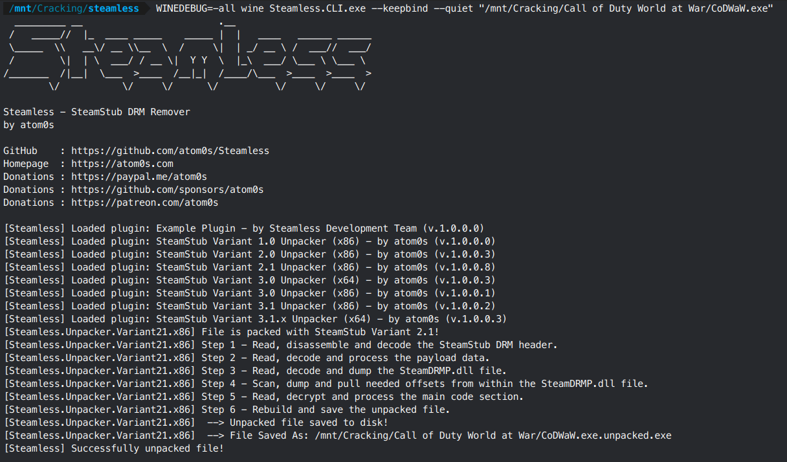
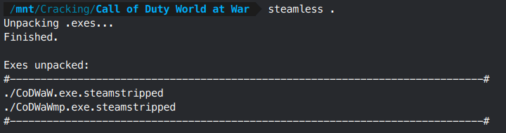

# **SteamDRM (Windows)**

This is a very basic DRM from Valve that wraps around an EXE. Also commonly referred to as SteamStub. It's primarily found on older games, but sometimes new games still come out with this wrapped around. I don't know why a developer would even bother in modern times.

It is trivially unwrapped by a tool named [Steamless](https://github.com/atom0s/Steamless). Grab the latest release and put it in your toolkit. Steamless is a Windows application, but it works well enough through Wine. It comes with a GUI and CLI version - the CLI version should be a bit easier to use on Linux, but I didn't have any trouble running the GUI either. Historically, Steamless has had [issues](https://github.com/atom0s/Steamless/issues/76#issuecomment-1191396442) running through Wine when your Wine environment did not have a proper setup, but those issues should be [fixed](https://github.com/atom0s/Steamless/pull/97) in any version >3.1.0.3. The version that fixes these issues is not currently released as of the writing of this guide, so if that's still the case by the time you read this, you should set up your system's Wine according to the Github issue. When we go through the crack walkthrough, I'll report the MD5 hash of the unwrapped EXE, so you can check that you're getting the same result as I am with your Wine setup.

# Cracking Guide

For our walkthrough we'll be cracking SteamDRM on Call of Duty - World at War. This game is easy to source via cs.rin's SCS (thread ID `55959`). This game uses only uses SteamDRM for protection.

1. Source "Call of Duty - World at War" and extract it to your workspace

2. Open a terminal in the toolkit folder where your Steamless tool lives, and run `WINEDEBUG=-all wine Steamless.CLI.exe --keepbind --quiet "/path/to/CoDWaW.exe"` to generate an unpacked EXE. This command will use your system's Wine setup. If you want to use a specific Wine prefix instead, use the `WINEPREFIX` environment variable.

    

3. Delete the original EXE and rename the new unpacked EXE to the original's name. (the MD5 hash of an unpacked CoDWaW.exe should be `354273f626af97142fd9797936332663` if your Wine is configured correctly)

4. SteamDRM is now defeated!


**Bonus:** You can put these two commands at the end of your `.bashrc`/`.zshrc`/etc in order to quickly run Steamless at will. I frequently run `steamless` on a new game's folder to auto-strip any EXEs that might have SteamDRM on them. EXEs that aren't packed with SteamDRM will not be affected, so it's just a quick method to get this DRM out of the way if it's there. Make sure you customize `STEAMLESSLOC` in the code below



```bash
# Steamless
export STEAMLESSLOC="/path/to/Steamless.CLI.exe"

# Point at an exe to strip it
steamless-single() {
    if [[ $# -eq 1 ]] && [[ -f "$1" ]]; then
        WINEDEBUG=-all wine "$STEAMLESSLOC" --keepbind --quiet "$1"
    else
        echo 'SteamDRM remover:'
        echo '-------------------------------------------------------------------------------'
        echo 'Argument 1: Input file'
        echo '-------------------------------------------------------------------------------'
        return
    fi
}

# Attempt to strip every EXE in a folder
# EXEs that are not packed with SteamDRM are unaffected
steamless() {
    if [[ $# -eq 1 ]] && [[ -d "$1" ]]; then
        cd "$1" || return
        echo "Unpacking .exes..."
        WINEDEBUG=-all find . -type f -name '*.exe' -exec wine "$STEAMLESSLOC" --keepbind --quiet {} \; &> /dev/null
        echo "Finished."
        echo ''
        find . -depth -name '*.unpacked.exe' -execdir bash -c 'mv -i "$1" "${1//.exe.unpacked.exe/.exe.steamstripped}"' bash {} \;
        echo "Exes unpacked:"
        echo '#-----------------------------------------------------------------------------#'
        find . -type f -name '*.exe.steamstripped'
        echo '#-----------------------------------------------------------------------------#'
        cd - &> /dev/null || return
    else
        echo 'Mass SteamDRM remover:'
        echo '-------------------------------------------------------------------------------'
        echo 'Argument 1: Input folder. All .exes in this folder will have their SteamDRM removed.'
        echo '-------------------------------------------------------------------------------'
        return
    fi
}
```