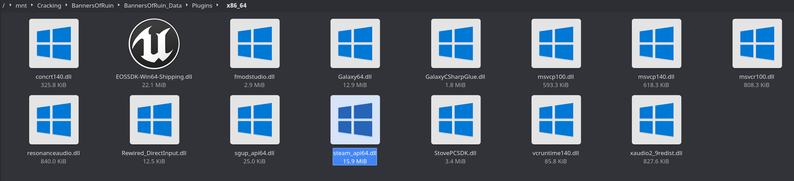

# **Steamworks API**

This is the big one. Most games you'll interact with are "protected" by Steamworks API. It's trivially bypassed by any number of tools, and often it's the only protection a game will have. At some point, publishers gave up on protecting their games and let GabeN's words ring true: "piracy is a service problem"

We defeat this DRM with `Goldberg Steam Emulator`, which is an excellent tool full of customization. Among its features are auto-unlocking of DLC, auto-LAN setup, achievement support, friends network, mod support, and support for native Linux games. The original "1st-gen" version of this emulator has been abandoned, and a few forks have been developed. For now, we're going to use the Detanup01 fork. If you want to track development of the forks, you can check the latest comments in the original Goldberg Steam Emulator thread, under cs.rin's `Main Forum -> Releases` section (thread ID `91627`). If you're interested in a tutorial for the 1st-gen version, my old guide is located [here](defeating_steamworks_1stgen.md). If a new fork overtakes this one, or if configuration steps change, I will try to keep this guide updated, but be warned that things are still a bit volatile at the moment.

Goldberg Steam Emulator:

  - [Goldberg Emulator GitHub](https://github.com/Detanup01/gbe_fork)

  - [Full Readme](https://github.com/Detanup01/gbe_fork/blob/dev/post_build/README.release.md)

  - [gbe_fork_tools GitHub](https://github.com/Detanup01/gbe_fork_tools)

Grab the latest release archives from the [Goldberg Emulator GitHub](https://github.com/Detanup01/gbe_fork/releases/latest) for your toolkit. You'll specifically need the `emu-linux-release` archive for the native Linux emulator and related tools, and the `emu-win-release` archive for the Windows emulator. You'll also need to visit the [gbe_fork_tools GitHub](https://github.com/Detanup01/gbe_fork_tools/releases/latest) to grab the `gen_emu_config_old-linux` archive for config-related tools. Within each OS's release archive, there are two versions: `stable` and `experimental`. There are a [handful of differences](https://github.com/Detanup01/gbe_fork/blob/dev/post_build/README.experimental.md) between stable and experimental, but generally the biggest ones for us are that experimental includes a Shift+Tab overlay which can display achievements, and it has a subsystem for injecting arbitrary DLLs that you put into one of its folders. I recommend using the experimental version by default, except in one case: some DirectX 9 games will crash if the overlay is enabled. If you have a DirectX 9 game that is having trouble with the overlay, either use the stable build or disable the overlay by editing the `configs.overlay.ini` file.

I will go over the basics in this guide, but you should read the [full readme](https://github.com/Detanup01/gbe_fork/blob/dev/post_build/README.release.md) to get comfortable with all the customizations this tool is capable of.

# Cracking Guide

For our walkthrough we'll be cracking the Steamworks API DRM on a Windows copy of Banners of Ruin. This game is easy to source via cs.rin's Main Forum (thread ID `107002`), or you can follow along with your own Steamworks-protected game. Banners of Ruin only uses Steamworks API for protection

1. Source Banners of Ruin and extract it to your workspace

2. Open a terminal in the base game directory and run the following command to locate the Steamworks API libraries: `find . -type f -name "steam_api.dll" -o -name "steam_api64.dll" -o -name "steamclient.dll" -o -name "steamclient64.dll" -o -name "libsteam_api.so" -o -name "steamclient.so"`

    

3. Navigate to those libraries and replace each one with its Goldberg Steam Emulator equivalent. If you're replacing DLLs, they are located in the `emu-win-release` directory, else the Linux `.so` files are in the `emu-linux-release` directory. Choose between the "experimental" build and the "regular" build, and then between 32 or 64 bit.

    

    

4. Find your game's Steam ID. The easiest way to do this is to go to its store page, and grab the number from the URL. The Steam ID for Banners of Ruin is "1075740".

5. Navigate to the `generate_emu_config-linux/generate_emu_config` directory in your toolkit, and run the following command: `./generate_emu_config -cve <STEAM_ID>`, where `STEAM_ID` is the ID from the previous step. This will give you a login prompt, which will use your Steam credentials to download extra information for the emulator, like DLC identifiers and achievements. If you don't want to use your login, you can instead put `-anon` in the command, though it won't be able to get as much information. As of writing, the login calls are prone to timing out, so if it doesn't seem like it's doing anything, cancel it and try again.

    

6. This command will generate configuration details in the `generate_emu_config/output/<STEAM_ID>` directory. We are specifically interested in the `steam_settings` directory there.

7. Copy the `steam_settings` directory next to each Steam library (`steam_api.dll`/etc.) that you replaced

    

8. If you're cracking inside a Wine prefix, create a file under `steam_settings` named `configs.user.ini` and insert the following lines in order to change the name displayed ingame:
    ```ini
    [user::general]
    account_name=Yote.zip
    ```
    - Goldberg normally has a global name that it will use for all games if you change it in the following places:
      - Windows: `C:/Users/<user>/AppData/Roaming/GSE Saves/settings/configs.user.ini`
      - Linux: `~/.local/share/GSE Saves/settings/configs.user.ini`
    - Since we're spinning up a Wine prefix per game, there's really no such thing as "global" to us. Each Wine prefix is effectively its own Windows install. It's easier to just configure it here as a hardcoded setting

9. Navigate to the `emu-linux-release/tools/generate_interfaces` directory, and execute the following command: `./generate_interfaces_x64 "/path/to/<steam_api.dll/so>"`, where the `steam_api` bit is your steam_api library that you replaced. You don't have to do this for `steamclient` libraries. This will generate a `steam_interfaces.txt` file in your current directory.

10. Copy the `steam_interfaces.txt` file next to the Steam library that you replaced.

    

11. Steamworks API is now defeated!

- Notes on features:
    - DLC is normally auto-unlocked on most games, as the config generator manually inserts each DLC ID into the `configs.app.ini` file. There is also an option in that file to automatically reply "yes" whenever a game asks if a user has a DLC. This is normally safe to enable by default, though in theory a game could try to detect emulators by asking for fake DLCs
    - You may rarely need to fill out `depots.txt` for a game to recognize DLC or other game content. An easy way to find depot IDs is to visit its SteamDB page
    - If you're using the experimental version, you can press Shift+Tab ingame to get an overlay that displays achievements
    - LAN play is auto-configured with Goldberg Steam Emulator - read the readme for details
    - I highly recommend reading the entire [Goldberg Steam Emulator readme](https://github.com/Detanup01/gbe_fork/blob/dev/post_build/README.release.md) for more information on all the other configurations you can perform with this tool

- If you're trying to crack one of the few native Linux games that requires a Steam runtime in order to work, follow the steps in the [Linux Steam Runtime guide](../../Tools/Linux-Steam-Runtime/configuring_linux_steam_runtime.md)

- Very rarely, games will need to use the `steamclient_experimental` feature. Copy these files in and configure `ColdClientLoader.ini`, then start the game using `steamclient_loader.exe` instead of the normal executable. The only game that I've personally seen require this is Dying Light 2. The game may warn you about "Steam not running" as a hint

- To crack Steamworks API (and [SteamDRM](../SteamDRM-Windows/defeating_steamdrm_windows.md)) automatically in the future, use my [SteamAutoDefeat](../../Tools/SteamAutoDefeat/steamautodefeat.md) tool


