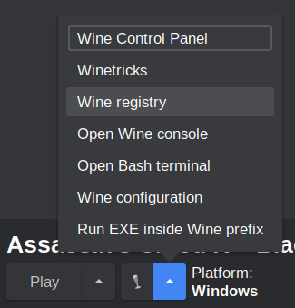
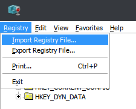
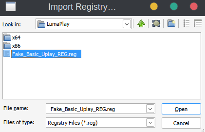

# **Uplay r1**

This is a common protection found on most Ubisoft games. They've recently switched to r2 for newer games, but most historical Ubisoft games you'll find are using this. Overall, this is not too difficult to crack, and the tool we're going to be using has sufficient configuration options so we don't need to work too hard.

The biggest problems with Ubisoft games are tangential - some DLC needs to be unlocked with a save game file (sourced from cs.rin or sometimes patched yourself with a cheat engine table), and usually save game files are encrypted differently for every unique Ubisoft Account ID. As far as I know, this style of DLC is usually limited to the "Uplay Rewards" system, so normal game DLC should auto-unlock. The Scene/userbase have not agreed upon a standard Account ID to use for these save games, so you'll often need to change your emulator's Account ID to match whatever save game you're trying to use, or convert save games from one Account ID to another using special tools.

Our tool of choice for breaking r1 is LumaPlay, which can be found in cs.rin's `Main Forum -> Releases` section (thread ID `67197`). Grab a copy of the 32-bit and 64-bit downloads for your toolkit.

While you're on the LumaPlay thread, navigate to page 29 and grab the `2018.06.12.7z` archive posted by Christsnatcher. Extract the `uplay_r1.dll` file to your 32-bit LumaPlay's `LumaPlayFiles` folder, and rename it to `UbiAPI.dll`. Similarly, extract the `uplay_r164.dll` file to your 64-bit LumaPlay's `LumaPlayFiles` folder, and rename it to `UbiAPI.dll`. These are required for LumaPlay to work, and I'm not entirely sure why LumaPlay doesn't include them by default. You're normally supposed to source them from the game you're cracking, but I've found that just using the latest one for everything has worked for every game I've tried.

We need to grab one more tool from the LumaPlay thread. Navigate to page 30 and download `Fake_Basic_Uplay_REG.7z` posted by Christsnatcher. This is a simple .reg file that can be used if a game is complaining about not having Uplay Launcher installed

# Cracking Guide

For our walkthrough we'll be cracking the Uplay r1 DRM on a copy of Assassin's Creed IV - Black Flag. This game is easy to source via cs.rin's SCS (thread ID `55902`), and uses Uplay r1 and Steamworks API for protection.

1. Source "Assassin's Creed IV - Black Flag" and extract it to your workspace

2. Defeat [Steamworks API](../Steamworks-API/defeating_steamworks.md) protection (Uplay r1 games won't always have this protection)

3. Since this is a 32-bit game, we'll copy `LumaPlay_x86.exe` to the game directory, along with the 32-bit version of the `LumaPlayFiles` folder

4. Open `LumaPlayFiles/LumaPlay.ini` in a text editor and configure the following:

    - `GameExe` - Change to the name of the EXE that normally starts the game. In our case it's `AC4BFSP.exe`

    - `PlayerName` - Change to whatever you want your name to show up as ingame

    - `UplayGameID` - Change to your game's official Uplay Game ID. You can find a public list of them [here](https://github.com/Haoose/UPLAY_GAME_ID/), or in a [local copy](uplay_app_ids.md) I made of that list. In our case, our Game ID is `437`

    - `Language` - Change if you need a language other than English. The list of available languages is right above the key

    - `AccountID` - Note this, you may need to change this if you're trying to play another user's save file

5. Uplay r1 is now defeated! To launch the game, you need to run e.g. `LumaPlay_x86.exe` instead of the game's original EXE.

- DLC will attempt to be auto-unlocked, but some DLC (usually just "Uplay Rewards") needs to be unlocked by using another user's save file. Each Ubisoft game is a little bit different with how it wants to unlock DLC - it's a good idea to read through the game's cs.rin thread and check what the recommended option for your game is.

- If your game complains about you not having the Uplay Launcher installed, import the `Fake_Basic_Uplay_REG.reg` to your Wine prefix. To do this in Lutris:

    1. Open the "Wine registry" option from the dropdown near the play button

        

    2. Click "Import Registry File..." from the "Registry" dropdown

        

    3. Find your .reg file and click "Open". Remember that in Wine, `Z:/` is your `/` from Linux

        

