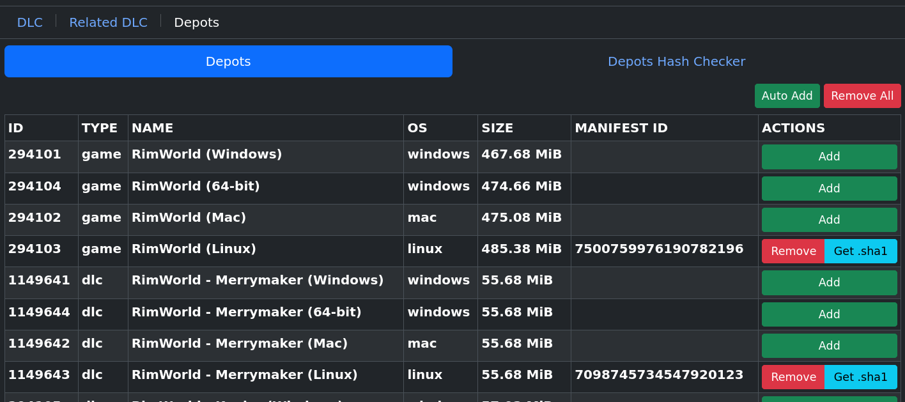

# **Linux Cracking Bible - The GNU Testament**

Heyo, I've tested/cracked around ~300 games on Linux and have attained a good amount of general knowledge that I feel should be documented and shared with others. The Linux Cracking Bible is basically a complete guide to my workflow with cracking and configuring arbitrary games on Linux. This guide uses legitimate copies of games and defeats their DRM with generic community/FOSS tools instead of using questionable cracks from questionable sources. I hope that this guide can give you confidence in controlling your gaming experience on Linux, even if you don't end up needing cracks to do it. Almost all of these techniques and tools work on Windows as well, but this is written as a Linux-first guide.

I'd wager most people who are deep into the piracy scene will know a moderate portion of this guide already, but I don't think many people will know all of it. One of the main reasons I'm writing this guide is because (to my knowledge), no one has even come close to writing out a practical guide on how to actually leverage all of the tools floating around to properly crack a game that you want to play. These tools and techniques sometimes feel like tribal knowledge, and documentation of how they work is of varying levels of quality. I hope to establish a better starting point for newcomers and untangle the thousands of forum posts into something usable.

Also, this is a coyote I drew. He will help you defeat DRM.


# **Table of Contents**


1. [Foreword](#1-foreword)
    - [About the author](#about-the-author)
    - [Game/crack compatibility](#gamecrack-compatibility)
2. [Keeping a clean workspace](#2-keeping-a-clean-workspace)
3. [Setting up Lutris and Wine](#3-setting-up-lutris-and-wine)
    - [Lutris](#lutris)
    - [Tips](#tips)
    - [Winetricks](#winetricks)
    - [Wine troubleshooting](#wine-troubleshooting)
4. [Sourcing a game](#4-sourcing-a-game)
5. [DRM research](#5-drm-research)
6. [DRM stripping guides](#6-drm-stripping-guides)
7. [Repacking](#7-repacking)
8. [Epilogue](#8-epilogue)
9. [Practice your skills](#9-practice-your-skills)

# **1. Foreword**

## About the author

I'm not a security specialist or reverse engineer and I don't know how to crack. I'm not involved with the piracy underground, and I've never collaborated with anyone else regarding how these things are supposed to be done. You might see me doing or saying something stupid in this guide, because everything I know is self-taught. For the most part I'm a monkey with a typewriter, barely understanding why the things I do work. And yet they work.

I'm personally very anti-DRM, but I don't mind buying games. I like to strip DRM and archive games that I like, so that I don't have to rely on online connections or seedy companies to tell me that I can play what I've already legally bought. I personally prefer to buy from Steam because of the massive support they have given to Linux gaming, but GOG could have some of my business if they put any support into Linux at all. I encourage any pirates that have disposable income to buy the games that they have enjoyed playing through their "extended demo" periods, especially if they are indie titles!

## Game/crack compatibility

There are generally two reasons that a game doesn't work on Linux: Anti-Cheat and DRM. Anti-Cheat is normally not a concern for us because it's usually isolated to multiplayer-only games. DRM can sometimes be a problem for legitimate users, but we won't be putting up with it. Stripping out the DRM can improve compatibility and allow certain games to run.

Almost every single game I've tested works with Linux itself, and there's a very high hitrate on arbitrary scene/p2p cracks working through Wine as well. In my experience, the only notable p2p cracks that don't work with Linux are the janky NFS Heat leaked crack (the one that started the Denuvo-pocalypse) and a handful of Empress's cracks (despite people donating specifically for Linux compatibility...). If you're trying to use a scene/p2p crack and it's not working on Linux, it's likely there's another scene/p2p crack that does. We won't be using these random cracks though - we prefer to do it ourselves with verified tools that are always Linux-compatible. As a reference, I've personally been able to crack about 85% of the games that I've run into, and I know nothing about real cracking.

# **2. Keeping a clean workspace**

We'll be doing a lot of science, and we want to make sure our experiments are clean and repeatable. I recommend setting up a dedicated empty folder to work out of. The partition that this folder is on should have at least ~300GB of space free, and I strongly recommend that the partition uses a BTRFS/XFS filesystem, or something else that allows "reflinking". Note that ZFS implemented reflinking in 2.2, but immediately removed it after stability concerns - it will return later! The TL;DR on reflinks is that they don't duplicate physical data when you copy-paste to the same partition. If I have a 100GB file at `/fileA.tar` and I copy it to `/fileA-copy.tar`, I will still have only 100GB of space used. Copy-pastes should automatically use reflinks if your filesystem is compatible. Reflinks are important for a number of reasons, but foremost because copy-pasting 100GB games here will be instant, and we can manage multiple versions of our tests easily.

When defeating DRM, you should always keep your clean game copy annotated as e.g. `GameName - CLEAN`. Whenever you are tinkering with a game, you should copy-paste your clean folder as a new folder (e.g. `GameName - TESTING`) and play with that instead. If you mess up or get lost, you can always wipe away your `TESTING` folder and start again from your `CLEAN` folder.

When configuring Lutris and Wine, you should fully delete your Wine prefix before testing different configurations. You don't want previous experiments influencing future experiments. While investigating e.g. what Wine components are needed for a game to work, it's important that you end up with only the minimum number of configurations necessary. The most important part of making a game work is knowing why it worked. Throwing 14 Winetricks packages at it, changing between Wine versions a few times, then having it start working is not useful knowledge.

As a general rule, when you're setting up a game on Linux, you should always use a unique prefix for every game. Some games need special configurations, and putting many games into the same prefix is asking for something to get messed up. Assuming you've already applied a crack to your game, the ideal procedure for a repeatable test is to configure your Wine parameters in Lutris, spin up a clean Wine prefix, install any Winetricks package required, copy your cracked game in, and run it. If you can't repeatedly get a working game from these steps, then something in your strategy is flawed.

# **3. Setting up Lutris and Wine**

## Lutris
[Lutris](https://github.com/lutris/lutris) is my favorite tool for configuring cracked games, but you can use alternatives like [Bottles](https://github.com/bottlesdevs/Bottles) if that's what you're comfortable with. I'll only be walking through configuring Lutris, but most of the information should be generally applicable to other tools as well - you'll just need to figure out how to apply it with your tool.

Whether you install Flatpak Lutris is mostly preference, but there are a few practical differences by using a Flatpak:
  - Flatpak Lutris uses Flatpak Mesa, which is generally kept cutting-edge. This is great if you're running a distro like Debian/Linux Mint, where your system Mesa setup is older.
  - You will not have access to the `/usr/bin` directory, so calling commands as "Command Prefixes" is limited. You can allow `filesystem=host` for Lutris through e.g. [Flatseal](https://flathub.org/apps/com.github.tchx84.Flatseal) and access your `/usr/bin` through `/run/host/usr/bin`, but you'll still be in an abnormal environment and things probably won't work as expected.
  - You will need to use e.g. [Flatseal](https://flathub.org/apps/com.github.tchx84.Flatseal) to manually allow Flatpak Lutris access to each directory that your game files/prefixes live in.
  - You can use [flatpak-spawn](https://docs.flatpak.org/en/latest/flatpak-command-reference.html#flatpak-spawn) to break out of the Flatpak sandbox a little bit, but it's of limited practical use
  - Disabling networking on a per-game basis does not currently work cleanly under Flatpak Lutris. This seems to be an issue with how Lutris handles `flatpak-spawn`. As of writing, chaining `flatpak-spawn` from Lutris wipes many environment variables and will likely cause issues in the resultant executable launch (especially if you use Proton). It is still possible to disable networking for all of Lutris in the meantime via e.g. [Flatseal](https://flathub.org/apps/com.github.tchx84.Flatseal).
  - Flatpak Lutris comes with several compatibility libraries included, which can be helpful for running older native Linux games that would otherwise require exotic/older packages to be installed on your base system.
  - `gamemode` comes with Flatpak Lutris, so no need to install it via your package manager
  - If you want to use `mangohud`, you will need to install the Flatpak version (using `flatpak install flathub org.freedesktop.Platform.VulkanLayer.MangoHud`) instead of the normal package from your package manager.
  - `libstrangle` will not be able to be used as it doesn't have a Flatpak version and relies on some `/usr` things. In place of it, you can use MangoHud's `fps_limit` [configuration](https://github.com/flightlessmango/MangoHud#environment-variables-mangohud_config-and-mangohud_configfile)

The process of adding a cracked game to Lutris is relatively simple. Click the "+" icon at the top left of the Lutris window, and click "Add locally installed game". You'll be presented with a window containing 4 tabs. Let's run through the most important parts of each tab.

**Game Info:**

  - `Runner` - This is where you tell Lutris what platform the game you're running is intended for. The most common options will be "Linux" and "Wine"

**Game Options:**

  - `Executable` - Points to the executable that will start the game
  - `Arguments` - AKA "launch options", "flags", whatever you want to call them. If I have a `game.exe` and I put `-g vulkan` into this box, Lutris will execute `game.exe -g vulkan` as a command
  - `Wine Prefix` - Fill this out to point towards a place where your new game's install should live. Ideally every game you install should have its own prefix. The folder you input does not have to exist yet.

**Runner Options (Wine only):**

  - `Wine Version` - Select what version of Wine you want to use when generating the prefix and playing the game. I normally use the latest version of [Proton-GE](https://github.com/GloriousEggroll/proton-ge-custom/releases), which works for almost all games. If there's a game that doesn't work with Proton-GE, your best chance at causing different behavior is by using an older [Wine-GE](https://github.com/GloriousEggroll/wine-ge-custom/releases) build or the staging-tkg version of [Kron4ek's Wine build](https://github.com/Kron4ek/Wine-Builds/releases). Note that Wine-GE will no longer receive updates past 8-26, as it has been effectively superseded by Proton-GE through the use of the new [umu-launcher](https://github.com/Open-Wine-Components/umu-launcher) initiative, which makes Lutris and other game runners behave exactly like the Proton runtime. Lutris automatically launches Proton-GE versions through umu-launcher when selecting a Proton build, and it automatically detects Proton runners from Steam's directory. This is newer technology and a small portion of games don't handle this Proton method nicely, in which case you may want to try traditional Wine builds. Rarely, there will be regressions in the newest versions of Proton/Wine builds, so if you're getting desperate you can start trying older versions to see if that resolves it. You can easily download different versions of Proton/Wine for Lutris by using [ProtonUp-Qt](https://github.com/DavidoTek/ProtonUp-Qt) (note that currently ProtonUp-Qt only downloads vanilla Kron4ek builds. You may want to download the `staging-tkg` version manually from their repo). To manually install Wine releases, extract the build to `~/.local/share/lutris/runners/wine/your-wine-build-X.XX` if you're using native Lutris, or `~/.var/app/net.lutris.Lutris/data/lutris/runners/wine/your-wine-build-X.XX` if you're using Flatpak Lutris.

  - `DXVK` - Emulates DX8, DX9, DX10, and DX11 for your game. I haven't seen any regressions in this in a very long time, so generally picking the latest version and leaving it alone is sufficient. You can also try the [Async variant](https://gitlab.com/Ph42oN/dxvk-gplasync) which can theoretically reduce stuttering, but the difference doesn't seem noticeable now that the magical Graphics Pipeline Library has been implemented in DXVK. I still use the Async version just in case it marginally helps. The one caveat is that Async DXVK can potentially trigger anti-cheats in online games because of the way it manipulates the render pipeline. To install the Async version, use [ProtonUp-Qt](https://github.com/DavidoTek/ProtonUp-Qt) and target your Lutris install, or extract the latest version from the [releases](https://gitlab.com/Ph42oN/dxvk-gplasync/-/tree/main/releases) section to `~/.local/share/lutris/runtime/dxvk/dxvk-gplasync-vX.X-X` if you're using native Lutris, or `~/.var/app/net.lutris.Lutris/data/lutris/runtime/dxvk/dxvk-gplasync-vX.X-X` if you're using Flatpak Lutris.

  - `VKD3D` - Emulates DX12 for your game. Pick the latest version and leave it alone, unless you want to intentionally disable DX12 to try to force a DX9/10/11 fallback

  - `D3D Extras` - Just leave it on, have never had an issue with it

  - `DXVK-NVAPI` - Emulates some Nvidia features even if you're using an AMD card. This can sometimes cause games to freak out, so it's a good idea to try disabling it if you're having problems launching.

  - `Esync/Fsync` - Just leave them on, have never had an issue with these

  - `DLL Overrides` - Very important section. By default, Wine hijacks some DLLs that load and replaces them with its own versions at runtime. By changing these settings, you can explicitly tell Wine that if it sees a specified DLL it should let it load without interfering. This is notable for us because we sometimes like to inject DLLs in order to defeat DRM, and if Wine gets in the middle they won't inject. Enter a DLL's name as a key, and set `n,b` as a value. `n,b` stands for "Native, then Built-in", aka Wine should preferentially let the game's local DLL load if available, or fallback to the Built-in Wine version if it's not. Whenever you put a DLL into a game folder that it didn't come with, it's a good idea to set that DLL to `n,b`. You can also set the value to `d` to prevent that DLL from loading at all.

**System Options:**

  - `Enable Feral GameMode` - Recommended to leave on. Install [gamemode](https://github.com/FeralInteractive/gamemode) from your package manager to enable this if you're not using Flatpak Lutris. It auto-configures Linux to give your game higher priority with resources, so occasionally it will improve performance

  - `FPS Counter (MangoHud)` - A useful tool. Install [mangohud](https://github.com/flightlessmango/MangoHud) from your package manager to enable this if you're not using Flatpak Lutris, or use `flatpak install flathub org.freedesktop.Platform.VulkanLayer.MangoHud` if you are. I leave it on when launching games for the first time so I can see their FPS and what graphics pipeline they're rendering with. Note that I have historically had many games crash when enabling this, but supposedly this issue has been [fixed](https://github.com/flightlessmango/MangoHud/issues/852). If you're struggling to get a game to work, it's worth a try to disable this and see if anything changes.

  - `FPS Limit` - You can put an FPS limit here and it will prevent the game from exceeding that FPS, even if the game doesn't have a way to limit itself. Install [libstrangle](https://gitlab.com/torkel104/libstrangle) to enable this option if you're not using Flatpak Lutris. If you're using Flatpak Lutris you won't be able to use this option, but can replace it by using MangoHud's `fps_limit` [configuration](https://github.com/flightlessmango/MangoHud#environment-variables-mangohud_config-and-mangohud_configfile).

  - `Reduce PulseAudio Latency` - Some games will have static in their audio without this option enabled. I leave it on all the time and don't have any issues.

  - `Environment Variables` - If you have any environment variables you want to auto-apply to a game, you can enter them here. Some important ones that I always leave on:
    - `STAGING_SHARED_MEMORY=1` - Increases performance in [rare cases](https://wiki.winehq.org/Wine-Staging_Environment_Variables)
    - `WINEDEBUG=-all` - Disables debug mode on Wine, which can [improve performance](https://wiki.winehq.org/Performance)
    - `mesa_glthread=true` - [Improved performance](https://wiki.winehq.org/Performance) with OpenGL (AMD)
    - `__GL_THREADED_OPTIMIZATIONS=1` - [Improved performance](https://wiki.winehq.org/Performance) with OpenGL (Nvidia)

  - `Command Prefix` - Just prefixes your game command with some arbitrary text. This is a powerful tool if you know you want to do something specific, but usually I don't need it

## Tips

- **Clean Wine prefix creation:** If you want to create a Wine prefix without running the game first, you can generate a clean one by selecting "Open Wine console", letting it set up the Wine prefix, then exiting out of the console when it pops up. I frequently use this feature when setting up new games - enter your desired Wine Prefix under the "Game Options" tab of a game, open the Wine console, and then you can copy your game into the prefix and start tweaking

    

- **Block a game's network access:** You can use the "Command Prefix" option in the "System Options" tab of a game in order to block a game's access to your networks:
  - If you use a non-Flatpak install of Lutris, you can install [bubblewrap](https://github.com/containers/bubblewrap) from your package manager and use the following prefix:
    - `bwrap --unshare-net --dev-bind / /`
  - If you use a Flatpak install of Lutris, you must use the `flatpak-spawn` command, as we don't have access to `bubblewrap` or networking privileges in the Flatpak sandbox. Note that Lutris seems to have an issue with executing `flatpak-spawn` cleanly, and it currently wipes many environment variables when used as a command prefix or directly as a program within Lutris. Historically, Flatpak versions below 15.6 had [another issue](https://github.com/flatpak/flatpak/issues/5278) that wiped out all environment variables, but this has been resolved in versions >=15.6, and testing `flatpak-spawn`'s handling outside of the Lutris framework works as expected. In our post-[umu](https://github.com/Open-Wine-Components/umu-launcher) world, this bug appears to be a showstopper as umu requires `GAMEID` to be set. As a workaround, you can also disable networking for the entire Lutris Flatpak, which doesn't have the same problem. If you find any extra info on what is breaking or any potential workarounds, let me know! In theory, the following command prefix should be able to be used without breaking environment variables:
    - `flatpak-spawn --no-network`

- **Sandbox a native Linux game:** If you want to sandbox a Linux game and force it to put its files in a specific place, you can add e.g. `--bind /output/directory /normal/directory/to/replace` to a `bwrap` command prefix, e.g. `bwrap --dev-bind / / --bind $HOME/FakeHome $HOME`, which will make a process unable to see your normal `$HOME` directory, and will instead place any files into `$HOME/FakeHome`. Native Linux games are often notorious about not respecting/understanding XDG Base Directory standards, as they're usually made by people who aren't very comfortable with Linux. This can help you to keep your `$HOME` tidy, or to manipulate a game into behaving a certain way. I often use this to make a game keep all of its save data in a directory next to its install location, for easy management and backup.

## Winetricks

If your game is having trouble starting on Wine, one of the likely culprits is that you need some Windows redistributables. You can use [Winetricks](https://github.com/Winetricks/winetricks) via Lutris in order to install them. Enter Winetricks, pick "Select the default Wineprefix", then select "Install a Windows DLL or component", and pick some packages to install.


Occasionally, the Winetricks GUI will exit prematurely without working. This is usually because Winetricks ran into an error and stopped itself. Almost always, the "error" is a result of Winetricks being confused. The normal solution for this is to tell Winetricks to keep going through the "error" anyway, but that's not possible with the GUI. In this case, you should use Winetricks via the CLI instead by using the following command:

```bash
WINEPREFIX="/path/to/your/game/prefix" winetricks -q -f YOUR_REDIST_NAME_HERE
```

The easiest way to guess what redistributables you need is to go to a game's SteamDB page, navigate to "Depots", and look at which redistributables it's using. Note that many redistributables are backwards-compatible, so installing e.g. `vcrun2022` will satisfy any `vcrun2017`/`vcrun2019` requirements, `dotnet48` will satisfy any lesser versions, and so on. Also, "DirectX" redistributables don't need to be installed, because DXVK/VKD3D are replacing them


 The most common redistributables you might need are:

  - `physx` is sometimes required for older games (Alpha Protocol, Dragon Age - Origins, Mass Effect 2/3 (not legendary edition), Medal of Honor, Mirror’s Edge, Need for Speed Shift/Shift2)

  - `xact` is sometimes required for older games if sound is not working properly (CoD - Black Ops, Fable III)

  - `faudio` is sometimes required if sound is not working properly (Skyrim SE, Fallout 4)

  - `vcrun2022` is sometimes required, and occasionally you’ll even get a popup from a game to tell you about it (Destroy All Humans 2, Forza Horizon 4, Hogwarts Legacy, Session). Sometimes mods will require vcrun as well. If a game's not working, it's easy to just throw `vcrun2022` at it and see if that helps anything.

  - `dotnet48` is sometimes required if you’re using modding tools or other types of 3rd party stuff. Users commonly create these tools using dotnet


## Wine troubleshooting

Wine is actually quite robust at this point. Most games I test work out of the box with no extra configurations. If a game is causing issues for you, I would try the following options to see if one of them fixes anything (roughly in descending order of success rate):

- Read ProtonDB for your game to check if there's anything obvious that people are reporting

- Try a different crack, if you're not using one of the pre-verified tools in this guide. Read through the game's cs.rin thread to make sure there's nothing exotic that might be required, e.g. some older games need .reg files to work, or some games use custom DRM

- Make sure you are properly overriding any DLLs that you are using (including any that come from a crack)

- Make sure you're not using Goldberg Experimental if your game is DirectX9, or disable Experimental's overlay

- Flip from `Proton-GE` to `Wine-GE`/`Kron4ek`, or vice versa

- Disable `NVAPI`

- Winetricks `vcrun2022`

- If the game can use another graphics pipeline, like DX9/DX11/DX12, try switching to a different one

- Winetricks `physx`, `xact`, `faudio` etc if you're tinkering with an older game

- Try to minimize and maximize the game, the game might not realize it's supposed to be active

- If the game is attempting to launch full screen, try to force it to start in windowed mode via Argument or through the game's configuration files

- Make sure that your system's vm.max_map_count is set to 1048576 with [this method](https://stackoverflow.com/questions/42889241/how-to-increase-vm-max-map-count) (not 65530 or 262144). Rarely, games will just crash if they run out of memory maps.

- Try an older Wine version

- Winetricks `dotnet48`

- If you're using Goldberg Steam Emu, try forcing it into offline mode (Some of the Borderlands games like to throw errors or load slowly if you don't do this)

- Disable `MangoHud`

- Disable `FPS Limit`

- Force the Prefix Architecture to the correct option, under the "Game Options" tab in Lutris. I've had a couple cases where it auto-picked wrong and caused problems

- Allow Network Access, if you're limiting it via command prefix

# **4. Sourcing a game**

If you already own the game on Steam or another marketplace, congrats, this part is easy! Just download the game from your client and copy paste it to your workspace.

If you don't own the game yet, you'll need to go exploring on the internet. One of the best places to find untouched games is cs.rin. If you don't have a cs.rin account yet, you'll need to make one in order to do basically anything from this guide. cs.rin hosts a lot of the tools that we'll be using, and you won't be able to download from there without an account.

Once you have a cs.rin account, navigate to the Steam Content Sharing (SCS) section of the forum, under `English Forums -> Steam Content Sharing`. Make sure you read the pinned `FAQ and Guide` post in this forum. It contains many important answers to problems you will soon be facing. Next, search for the name of your game (often, game franchises are condensed into one forum post: "Fable 3" -> "Fable Series"). If you find a forum post for it here, it will likely have download links available. At this point, you just need to download each part of the game and remember what the FAQ told you about passwords and google drive limits. After all the parts are downloaded, extract the nested game folder from the archive into your workspace.

`NOTE - as of August 2023, circumstances caused almost all historical Google Drive links from the SCS section to be invalid. Nowadays, most people are primarily uploading to the Main Forum section, as described just below.`

If you don't find it in the SCS forum, you should next check the `Main Forum` for your game's entry. Navigate to `English Forums -> Main Forum` and search for your game's name. It's very likely you'll find a thread for it - flip to the last post and start reading backwards through the thread. It's likely that someone will post the Clean Steam Files (CSF) at some point. Normally the people that upload these files will tag them with the exact BuildID that they downloaded from Steam, so if you know which version you're looking for you can usually find the exact post you need by putting the desired BuildID in the search bar. You can see the latest BuildIDs for a game by visiting its page on [SteamDB](https://steamdb.info) and clicking the "Patches" button. The build/patch history is sort of like Git's commit history; each time a developer pushes new files to Steam, a new BuildID is created.

If you're somehow not able to find a copy of the game on cs.rin, then you have to do deeper exploring through the internet. Take a look through some of the sites on [FMHY](https://fmhy.pages.dev/gamingpiracyguide/) and get creative.

**Protip**: When sourcing Steam-based games from places you don't trust, you can verify that the files you've ended up with are a clean copy by visiting a game's SteamDB "Depots" section with the [Get Data from Steam/SteamDB](https://github.com/Sak32009/GetDataFromSteam-SteamDB) userscript installed. To use this feature, you need to be logged into SteamDB, as it hides hashes from guest users. Once you're in the "Depots" section, pick the "branch" that you're interested in comparing against from the bottom of the page (usually you want to pick `public`). Next, click the green "Add" button next to each "depot" that you're expecting to be included in your local game directory. Games often conditionally serve different languages or DLCs using these separate depots, combining them together into a single output at download time. For example, in the image below I've selected the base game and first DLC for Rimworld:



Next, select the "Get Data from Steam / SteamDB" prompt at the bottom right of the page, and switch to the "Depots Hash Checker" tab. The userscript expects a specific hash manifest format, so I've written [a small shell script](Tools/rhash-steamdb/rhash-steamdb.sh) that can be used to generate a compatible manifest using [RHash](https://github.com/rhash/RHash) on Linux. Additionally, you may find [this userstyle](Tools/Bigger-SteamDB-Hash-Modal/userstyle.css) handy for making the hash results window larger, and thus actually readable.


**Protip**: You should set up `!cs` and `!scs` Firefox bangs that allow you to perform searches in the `Main Forum` and `SCS` forum directly from your browser's search bar. To do this, go to the relevant forum, right click inside the "Search this forum..." textbox, and click "Add a keyword for this search". Save the bookmark somewhere out of the way and type `!cs` or `!scs` into the keyword box. Now you can type e.g. `!cs Fable 3` into your search bar and get direct results from the Main Forum.

We're assuming from this point forwards that you've obtained a clean copy of your game and copied it to your workspace.

# **5. DRM research**

In order to defeat DRM, we first need to know what types of DRM we're up against. Games can contain one or many types of DRM. If it came from the SCS forum, it's most likely at least using Steamworks API. We can search through [PCGamingWiki](https://www.pcgamingwiki.com/) for our game and look through the "Availability" section at the top, which will likely give us a general idea of what type of DRM is inside. PCGamingWiki sometimes lacks precision on which specific version of a company's DRM is being used, but it's an easy way to get a general idea. While we're here, we should check if our game has Denuvo or Arxan DRM included. If it does, we won't be able to crack it. Denuvo is nearly impossible to crack even for people who know what they're doing, but Arxan has been shown to be at least a bit easier. Unfortunately, I'll need more typewriters before I figure out how to get rid of those DRMs.

**CEG (Steam Custom Executable Generation):**
  - Very rarely in older games.
  - No new games have this DRM. Check if your game is on [this historic list](DRM/CEG/list_of_ceg_games.md).

**Epic Online Services (EOS):**
  - Very common if you sourced your game from Epic
  - Telltale files:
    - `EOSSDK-Win32-Shipping.dll`
    - `EOSSDK-Win64-Shipping.dll`
    - `libEOSSDK-Linux-Shipping.so`
  - Sometimes games will include these files without using them

**Games for Windows Live (GFWL):**
  - Very rare, games from ~2007-2013
  - It's a good idea to check the PCGamingWiki page for your game, since GFWL is often stripped out by the developer - GFWL may only be present on specific versions of a game
  - No new games have this DRM. Check if your game is on [this historic list](DRM/GFWL/list_of_gfwl_games.md).

**GOG Galaxy:**
  - Very common if you sourced your game from GOG
  - Not traditional DRM, but it's a service library that communicates with GOG middleware for e.g. multiplayer and achievements
  - This isn't *required* to be removed or defeated, but you have the opportunity to emulate it and completely cut GOG out of the pipeline
  - I don't own many GOG games, so I haven't tried very hard to play with this yet
  - Related projects I'm keeping my eye on:
    - [UniverseLAN](https://github.com/grasmanek94/UniverseLAN)
    - [Comet](https://github.com/imLinguin/comet)
  - Telltale files:
    - Galaxy.dll
    - Galaxy64.dll

**Origin (Old):**
  - To my knowledge only 8 games had this DRM, but they were all blockbuster games so you're still likely to run into it
  - Not generically defeatable to my knowledge, so not very useful for us
  - This can look very similar to new Origin DRM
  - If you're not sure whether your game is old or new Origin DRM, check the [Old Origin DRM list](DRM/OldOrigin/list_of_oldorigin_games.md).
  - If you're still confused whether your game is old or new Origin DRM, you can run your game executable through `Anadius's Origin Unwrapper` and it will tell you that there is no .ooa section if it's the old version (more info on this tool in the [Origin cracking guide](DRM/NewOrigin/defeating_origin.md))
  - Telltale files:
    - `__Installer` folder
    - `Core` folder

**Origin (New):**
  - Very common if you source from Origin or are working with an EA game
  - This can look similar to old Origin DRM. If you're not sure, check that your game is not on the [Old Origin DRM list](DRM/OldOrigin/list_of_oldorigin_games.md).
  - Telltale files:
    - `__Installer` folder
    - `Core` folder with `ActivationUI.exe` inside
    - `Core` folder with `Activation.dll` inside
    - `Core` folder with `Activation64.dll` inside
    - If you have icons displaying for exes, the typical Origin logo should be displaying for a lot of exes around the game folder

**Rockstar Social Club:**
  - Common in newer Rockstar-developed games
  - Pseudo-generically crackable via Goldberg's Socialclub Emulator (ideally TANGaming's fork), but works with so few games and requires specific configurations for each, so not very useful as a generic tool
  - Check cs.rin game threads for configurations instead
  - Telltale files:
    - `socialclub.dll`

**Securom:**
  - Rarely in older games. More common on games that were released via physical disc.
  - It's a good idea to check the PCGamingWiki page for your game, since Securom is sometimes stripped out by the developer - Securom may only be present on specific versions of a game
  - On launch, games with Securom will sometimes display a popup with something like `Application load error 5:0000065434`
  - No new games have this DRM. Check if your game is on [this historic list](DRM/Securom/list_of_securom_games.md).

**SteamDRM / SteamStub (Windows):**
  - Sometimes in Steam games
  - Most games that have this are older but new games can still use it
  - On launch, games with SteamDRM will sometimes display a popup with something like `Application load error 5:0000065434`
  - Run the game's executables through `Steamless` and check if you get an `.unpacked.exe` file output (more info on this tool in the [SteamDRM (Windows) Guide](DRM/SteamDRM-Windows/defeating_steamdrm_windows.md))

**SteamDRM / SteamStub (Linux):**
  - Very rare in older native Linux Steam games
  - Run the game's executables through `pyUnstub` and check if you get something other than "error on parsing headers" (more info on this tool in the [SteamDRM (Linux) Guide](DRM/SteamDRM-Linux/defeating_steamdrm_linux.md))

**Steamworks API:**
  - Extremely common if you source from Steam
  - Telltale files:
    - `steam_api.dll`
    - `steam_api64.dll`
    - `steamclient.dll`
    - `steamclient64.dll`
    - `libsteam_api.so`
    - `steamclient.so`

**Ubisoft Orbit API:**
  - Rarely in older Ubisoft games, from around ~2010-2012
  - Not generically defeatable to my knowledge, so not very useful for us
  - Telltale files:
    - `ubiorbitapi_r2.dll`

**Uplay r1:**
  - Common in older Ubisoft games (pre ~2020)
  - Telltale files:
    - `uplay_r1_loader.dll`
    - `uplay_r1_loader64.dll`

**Uplay r2:**
  - Common in newer Ubisoft games (~2020 and on?)
  - This DRM is commonly accompanied by Denuvo nowadays, so usually that's the bigger hurdle
  - Telltale files:
    - `uplay_r2_loader.dll`
    - `uplay_r2_loader64.dll`

**Xbox Live:**
  - Common in modern Microsoft/Xbox Studios games
  - I haven't seen enough of these games in the wild to see a true pattern. Potential telltale files are:
    - `Party.dll`
    - `PartyWin.dll`
    - `PartyWin7.dll`
    - `PartyXboxLive.dll`
    - `Microsoft.Xbox.Services.dll`
  - You can check if your game is on this [partial list](<DRM/Xbox Live/list_of_xbox_live_games.md>), but it's a modern DRM so the list may become outdated

**Custom DRM:**
  - Very rarely, developers try to roll their own custom DRM. This type of DRM is inherently impossible to generically detect/defeat, as it can be implemented in any number of ways
  - Luckily, they are usually not very good at it. Anyone with half a brain can create a crack for this DRM in most cases. These requirements are unfortunate for you and I, the brainless
  - Checking the game's cs.rin thread will likely reveal a crack made by someone in the community for any games that have custom DRM

If you are still puzzled on what DRM your game is using, reading the posts in its dedicated cs.rin thread is probably your best bet.

# **6. DRM stripping guides**

| Guide                                                                                | Stripped By                        |
|--------------------------------------------------------------------------------------|------------------------------------|
| [CEG (Steam Custom Executable Generation)](DRM/CEG/defeating_ceg.md)                 | Koaloader + LumaCEG                |
| [Epic Online Services (EOS)](DRM/EOS/defeating_eos.md)                               | Nemirtingas Epic Emulator          |
| [Games for Windows Live (GFWL)](DRM/GFWL/defeating_gfwl.md)                          | Catspaw GFWL Emulator (15d)        |
| [Origin (New)](DRM/NewOrigin/defeating_origin.md)                                    | Anadius Origin Unwrapper+Emulator  |
| [Securom](DRM/Securom/defeating_securom.md)                                          | Virusek+Neogame Generic 7/8 Bypass |
| [SteamDRM / SteamStub (Windows)](DRM/SteamDRM-Windows/defeating_steamdrm_windows.md) | Steamless                          |
| [SteamDRM / SteamStub (Linux)](DRM/SteamDRM-Linux/defeating_steamdrm_linux.md)       | pyUnstub                           |
| [Steamworks API](DRM/Steamworks-API/defeating_steamworks.md)                         | Goldberg Steam Emulator            |
| [Uplay r1](DRM/Uplay-r1/defeating_uplay_r1.md)                                       | LumaPlay                           |
| [Uplay r2](DRM/Uplay-r2/defeating_uplay_r2.md)                                       | Goldberg Uplay r2 Emulator         |
| [Xbox Live](DRM/Xbox%20Live/defeating_xbox_live.md)                                  | Goldberg Xbox Live Emulator        |

## This is a list of some extra tools we can use as needed:

| Tool                                                                                | Purpose                                                  |
|-------------------------------------------------------------------------------------|----------------------------------------------------------|
| [Koaloader](Tools/Koaloader/koaloader.md)                                           | Customizable DLL Injection                               |
| [SteamAutoDefeat](Tools/SteamAutoDefeat/steamautodefeat.md)                         | Crack Steamworks API and SteamDRM games more efficiently |
| [Steam Linux Runtime](Tools/Linux-Steam-Runtime/configuring_linux_steam_runtime.md) | Required for certain native Linux games                  |

# **7. Repacking**

Now that we've got all these snazzy offline games, we should keep a backup so that we don't lose them when a game publisher decides that we're not allowed to play anymore. Compressing games to their absolute smallest size is an art, and there's a **lot** more that goes into it than you might think. You should show respect to your local repackers who put in their knowledge, time, skill, and bandwidth to help you play games as effortlessly as possible.

The TL;DR on compressing games is that games are already compressed... poorly. Even if game developers were using the best compression technologies, they are inherently targeting different attributes than we are. Game developers primarily use compression that is good at "pack once, unpack many". They don't care how long it takes to pack the files in, they just want them to come out fast. Their goals are generally `Decompression Speed > Filesize > Compression Speed`, because they want their game's load times to be as short as possible. Our goals are more along the lines of `Filesize > Decompression Speed > Compression Speed`, because we want to save as much disk space as possible, and we don't want to wait around forever for it to install.

Great, so let's just compress using our favorite compression algorithm instead of theirs right? That's correct, but the problem is that their stuff is already compressed, and compressing it again with our algorithm doesn't work very well. Compression relies a lot on heuristics and patterns, and when it's already compressed those natural patterns don't exist anymore.

Okay, so let's just decompress their stuff and then we can compress with our compression algorithm. That's ideal, and we'll get a lot smaller repack sizes this way. The tools that perform this operation are called "precompressors", and they're very important if we want to compress as efficiently as possible. Unfortunately, the precompressors used to compress and decompress game developers' proprietary formats don't work very well on Linux, often crashing or not running at all.

So what can we do? Well, we can't use any of the precompressors, but we still have one trick up our sleeve. As luck would have it, it happens to be a pretty good one. The archiving program that repackers use is named FreeArc, and the newest version happens to have a Linux version. Even without any precompressors, FreeArc can still destroy traditional compression programs in terms of compression ratio. This is largely due to its global deduplication algorithm, which can match duplicate chunks all the way across a file instead of only in a short window. FreeArc also includes some great compression algorithms that we'll be making use of.

Putting it all together: we're going to download [FreeArc Next](https://encode.su/threads/2621-FreeArc-Next), put it in our toolkit, and compress games using the following command (change threads as desired, but be wary of memory usage by using too many):

```bash
fa a "output.arc" --threads=12 -mrep:128mb+dispack070+delta+lzma:128mb:normal:16:mc8 -t -dup "YOUR_GAME_DIR_HERE"
```

This command compresses games relatively quickly while still achieving close to max possible compression achievable by FreeArc. Decompression of the resultant archives is also very quick. To decompress an `.arc` created by this tool, use the following command (change threads as desired, but be wary of memory usage by using too many):

```bash
fa x "YourGameArchive.arc" --threads=12 -dp"/path/to/output/directory"
```

There's one caveat here: If your game contains any symbolic links, FreeArc Next will ruin them. In my experience, the only games that use symbolic links are ones that we apply `runtime-installer.sh` to. If you want to compress a game that uses symbolic links, you should instead install a tool named [DwarFS](https://github.com/mhx/dwarfs) from your package manager. DwarFS is not quite as good as FreeArc, but it's still a respectable tool and will work in a pinch. To compress a game using DwarFS, use the following command (change memory constraint as desired):

```bash
mkdwarfs --memory-limit=6g -l7 -B30 -i "YOUR_GAME_DIR_HERE" -o "output.dwarfs"
```

To decompress a .dwarfs created by this tool, use the following command (change memory constraint as desired):

```bash
dwarfsextract --cache-size=6g -i "YourGameArchive.dwarfs" -o "/path/to/output/directory"
```

You probably also want to put `nice -n 10` before each command, e.g. `nice -n 10 fa x "game.arc"`, to deprioritize the process in favor of the rest of your running applications.

Now that we know how to compress efficiently, it's also a good idea to consider ripping out things that we don't need. You'll notice that most repackers split out each language of a game into a separate download - there's a good reason for this. Audio does not compress very well, and foreign languages actually take up a relatively large portion of a game's filesize. If we explore a game's files using something like [Filelight](https://apps.kde.org/filelight/), we're often able to find foreign audio and delete it before compressing, saving us far more space than any algorithm could.

# **8. Epilogue**


We made it to the end! This project originally started as a reply to someone, then it became a forum post, then I ran out of forum post space. As I type this, the sum total of characters in this guide is ~100k. I started this project when my forum post hit 10k characters. As I mentioned in the intro, I'm not an expert on any of this, I'm just someone who's putting the pieces together.

I hope you enjoyed this guide and feel more comfortable removing DRM by yourself.

Bonus meme: now that you know how easy it is to crack most DRMs, it becomes very funny when piracy groups drop releases like `-XKILLDEATH STRIKES AGAIN! THE UNRELENTING FORCE! RESPECTED BY ALL...` and what they’ve actually done is put a generic Steam emulator into the folder and changed an app ID. Making the NFO probably took 20x the effort.


# **9. Practice your skills**

The real fun is doing it yourself. If you want more experience with cracking different DRMs, you can use the list below as guided practice.

## **Easy Mode**

**CEG (Steam Custom Executable Generation)**:
- Call of Duty Black Ops 1 (+Steamworks API, Winetricks `xact` for sound)
- Call of Duty Black Ops 2 (+Steamworks API)
- GRID 2 (+Steamworks API, careful of NVAPI crashes on this one)

**Origin (New)**:
- Battlefield 4
- Mass Effect 1/2/3 Legendary Edition
  - For ME1/2 you need to put the following as a launch option: `-NoHomeDir -SeekFreeLoadingPCConsole -Subtitles 20 -OVERRIDELANGUAGE=INT`
  - For ME3 you need to use `-NoHomeDir -SeekFreeLoadingPCConsole -Subtitles 20 -language=INT`
- The Sims 4

**Securom**:
- Mercenaries 2
- NFS Shift (+SteamDRM, Winetricks `physx`)

**SteamDRM / SteamStub (Windows)**:

- GRID
- Mirror's Edge
- Star Wars - The Force Unleashed 2
- TES IV: Oblivion

**Steamworks API (Windows/Linux)**: The following games can be cracked with Goldberg on their Windows and Linux versions (try both!):
- Bastion
- Inscryption
- Pyre
- Rimworld
- Shapez.io

**Uplay r1**:
- Assassin's Creed Unity (+Steamworks API)
- Assassin's Creed 3 Remastered (+Steamworks API)

**Xbox Live**:
- Forza Horizon 4 (Winetricks `vcrun2022`)


## **Extra Credit**

**Guess and crack the DRM:**

- Hotline Miami 2

- Outer Wilds

- Titanfall 2

- The Elder Scrolls V - Skyrim Anniversary Edition

- Far Cry 4 (may require Kron4ek to run)

- Fallout 4

- Star Wars Jedi - Fallen Order (Oddly, IIRC SwGame-Win64-Shipping.exe is just fully DRM-free. Try cracking starwarsjedifallenorder.exe instead)

**Misc:**

- Left 4 Dead 2 (Linux version) (+Steamworks API and it requires runtime-installer.sh usage)

- Far Cry 5 (CODEX Denuvo-cracked release. Switch from the CODEX Uplay r1 emulator to LumaPlay instead)

- Get achievements to show up in a game that uses Goldberg Steam Emulator (Shift+Tab to show the overlay)

- Stellaris (+Steamworks API. Unlock the DLC ingame by configuring Goldberg's emulator. Hint: You need to configure DLC IDs. Try [this tool](https://github.com/Sak32009/GetDLCInfoFromSteamDB/) on Stellaris's SteamDB to get a DLC list, if needed)

- Middle Earth: Shadow of Mordor (Linux) (+Steamworks API and runtime-installer.sh. Get the DLC working ingame by configuring Goldberg's emulator. Hint: you need to configure Depot IDs and DLC IDs. Use [SteamDB](https://steamdb.info/app/241930/depots/) to find depot IDs, if needed)
