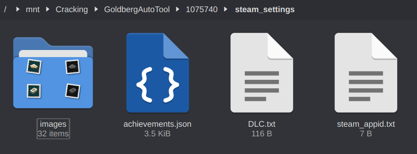
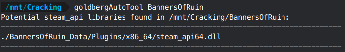

# **GoldbergAutoTool**

**NOTE**: This page is a tutorial for my 1st-gen Goldberg Steam Emulator auto-cracking script. This version still works on most games, but will eventually fall behind the Steam SDK on updates, as the original Goldberg Steam Emulator has been abandoned. A 2nd-gen auto-cracking script is located [here](../SteamAutoDefeat/steamautodefeat.md). The 1st-gen guide will likely not be updated very much in the future

Steamworks API is the most common form of protection you'll encounter, so I wrote a script to help automate cracking it. Windows users have many programs for this, but I didn't see any for Linux. This will allow you to automatically install and configure Goldberg Steam Emulator with as much extra data as we can scrape from the Steam API. The next steps will set up a small automated environment that can wrap around a few tools and cut down the work we need to do in the future.

First, we're going to compile a tool named `generate_game_infos`. This tool will automatically fetch rich DLC information, achievements, achievement images, and any items from a game's Steam inventory system.

1. Create an empty folder somewhere. We're going to pull some source code into it for compilation

2. Download [generate_game_infos.cpp](https://github.com/oureveryday/Goldberg-generate_game_info/blob/master/src/generate_game_infos.cpp) and save it into the folder (it's archived but still works fine)

3. Download [json.hpp](https://github.com/nlohmann/json/blob/develop/single_include/nlohmann/json.hpp) and save it into the folder

4. Download [fifo_map.hpp](https://github.com/nlohmann/fifo_map/blob/master/src/fifo_map.hpp) and save it into the folder

    

5. Open `generate_game_infos.cpp` in a text editor and change the lines on ~12-13 from:
    ```cpp
    #include <nlohmann/json.hpp>
    #include <nlohmann/fifo_map.hpp>
    ```

    to

    ```cpp
    #include "json.hpp"
    #include "fifo_map.hpp"
    ```

6. Open a terminal in the build folder and run the following command: `g++ -o generate_game_infos generate_game_infos.cpp -lcurl`

7. If you get any errors about "curl", make sure you have `curl` development libraries installed via your package manager.

8. It will build a program for us named `generate_game_infos`. Set this program as executable (via `chmod +x` or etc). If we run `./generate_game_infos -h` we get the following help text:

    ```
    Usage: ./generate_game_infos app_id <-s steam_api_key> <-o output_path> <-i>
    -s: Using steam API instead of xan105 API
    -o: Output path(default is folder with app_id/steam_settings)
    -i: Disable generate achievement images
    ```

9. Navigate to https://steamcommunity.com/dev/apikey and get an API key. We need an API key in order to scrape achievements off the Steam API

10. Test your API key with the following command `./generate_game_infos -s YOUR_API_KEY 1075740`. Don't worry about the `Failed to get infos` error if it shows up - it will happen if a game doesn't have any Steam inventory items (almost always):

    

11. This should generate a folder with some useful stuff in it.

    

Next, we're going to set up some other resources.

1. Create a folder in your toolkit named `GoldbergAutoTool`

2. Copy the program we just compiled to that folder

3. Create a folder nested in `GoldbergAutoTool` named `goldberg_emu`

4. Extract the latest version of Goldberg Steam Emulator into `goldberg_emu`

    

5. Create a folder nested in `GoldbergAutoTool` named `controller`

6. From a normal Steam install, navigate to `<Steam Directory>/tenfoot/resource/images/library/controller`, and copy the `api` folder into `GoldbergAutoTool/controller`. Rename the `api` folder to `glyphs`. This will give us better controller glyphs, instead of the free ones that Goldberg Steam Emulator comes with

7. Lastly, copy my [auto-cracking script](goldbergAutoTool.sh) to `GoldbergAutoTool` as `goldbergAutoTool.sh` and make it executable

8. Your GoldbergAutoTool directory should now look like this:

    
    

9. At the top of `goldbergAutoTool.sh`, configure the following:
    - `GOLDSTEAM_API_KEY` (set to your Steam API key that you just retrieved)
    - `GOLDPLAYER_NAME` (set this to a name that will be auto-forced whenever you crack a game)
    - `EXPERIMENTAL_ENABLED` (set this to 'Y' or 'N' depending on whether you want to use experimental Windows builds by default)

10. For ease of use, I recommend putting the following code at the end of your `.bashrc`/`.zshrc`/etc and restarting your terminal. This allows you to use `goldbergAutoTool.sh` from any location

    ```bash
    alias goldbergAutoTool="/path/to/GoldbergAutoTool/goldbergAutoTool.sh"
    ```

11. Now let's look at what it does. Run `goldbergAutoTool` and you'll get usage notes:

    

12. With `Detect Mode`, you can quickly find where Steam libraries are located in a game's folder. For example:

    

13. With `Cracking Mode`, you can automatically set up a rich installation of Goldberg Steam Emulator. The only thing you need is the game's Steam ID. For example:

    

14. This results in the following configuration:

    

    

15. Note that:
    - It replaced all Steam libraries, saving the originals as `.bak`. This will detect 32/64-bit automatically
    - It auto-generated a `steam_interfaces.txt` file
    - It generated achievements and downloaded images for them
    - It auto-filled out the `DLC.txt` file. Note that you should generally let Goldberg Steam Emulator auto-unlock DLC without trying to force it manually. If a game needs DLC to be filled out manually, you can rename `DLC.txt.onlyifneeded` to `DLC.txt`:

        ```
        1359660=Banners of Ruin - Supporter Pack
        1937690=Banners of Ruin - Powdermaster
        2191860=Banners of Ruin - Moonstone
        ```

16. Steamworks API games can now be cracked in a single command. This DRM is by far the one you'll encounter the most, so it pays to cut down on the time you spend repeating the work.


