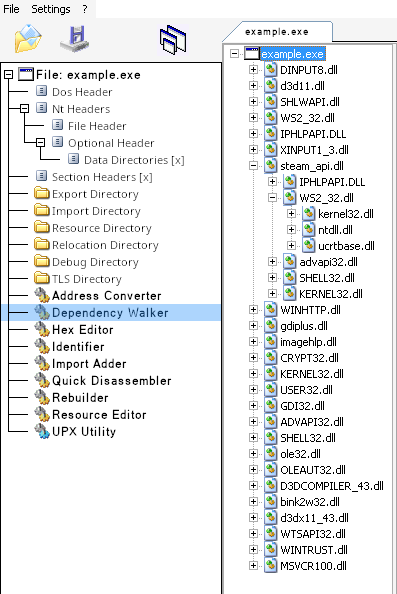
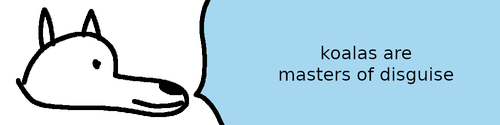

# **Koaloader**

[Koaloader](https://github.com/acidicoala/Koaloader) is a nifty tool that lets you arbitrarily inject DLLs into a program at runtime, some of which can auto-defeat DRM. Using Koaloader is one of the harder parts of this guide because it requires some investigation. You might have noticed that Windows executables usually come with a lot of DLLs scattered around next to them. When a game launches, it dynamically checks for and loads these various DLLs at runtime. Our special trick is that oftentimes games carelessly look for a number of common DLLs that it doesn't ship with, and will load them into itself if it finds them. We're going to exploit this naivety and drop a Koaloader DLL into the game directory disguised as a common DLL. The game will load Koaloader, and Koaloader will then inject any other DLLs that we specify.

Using Koaloader is optional for some DRM techniques. Koaloader can load multiple DLLs at one time, but if you only have one to inject you might be able to get away with renaming that DLL directly as a surrogate instead. This doesn't always work, and some DLLs insist that they have specific names (LumaCEG). Keep your options open and be ready to use Koaloader if the situation calls for it.

# Variants

The main problem to solve when using Koaloader is figuring out which common DLL variant a game will try to load in the first place. One way to deterministically find candidates is to use [CFF Explorer](https://ntcore.com/explorer-suite/) and analyze the game's exe. CFF Explorer is one of the few tools that runs well enough with Wine and doesn't require direct process hacking. To use CFF Explorer:
  1. Download the Explorer Suite from the link above, and install it into any Wine prefix
      - After installation you can put the resultant `CFF Explorer.exe` into your toolkit, it's sufficiently standalone
  2. Run `CFF Explorer.exe` with Wine
  3. Open the game's executable through CFF Explorer
  4. Navigate to the "Dependency Walker" section in the left-side pane

  

  5. This will show you a list of DLLs that the game attempts to reach for.
      - Most DLLs have their own dependencies that they reach for, and so on
      - If you don't see any common targets in the first layer, you can investigate further down the dependency chain

Koaloader (currently) comes in the following variants:

  - `audioses.dll`
  - `d3d9.dll`
  - `d3d10.dll`
  - `d3d11.dll`
  - `dinput8.dll`
  - `dwmapi.dll`
  - `dxgi.dll`
  - `glu32.dll`
  - `hid.dll`
  - `iphlpapi.dll`
  - `msasn1.dll`
  - `msimg32.dll`
  - `mswsock.dll`
  - `opengl32.dll`
  - `profapi.dll`
  - `propsys.dll`
  - `textshaping.dll`
  - `version.dll`
  - `winhttp.dll`
  - `winmm.dll`
  - `wldp.dll`
  - `xinput9_1_0.dll`

If you don't want to use CFF Explorer, you can also throw all the DLLs into the directory and see what works. I've had the most luck with `version.dll`, `winmm.dll`, `iphlpapi.dll`, and `winhttp.dll`. `dinput8.dll` is very commonly used in user-created mods, and it's a good target to check also.

# Configuration

**Protip:** After extracting Koaloader to your toolkit, I recommend replacing the contents of its default `Koaloader.config.json` file with the following:
```json
{
  "logging": true,
  "enabled": true,
  "auto_load": false,
  "targets": [
    "program32.exe",
    "program64.exe"
  ],
  "modules": [
    {
      "path": "target.dll",
      "required": true
    },
    {
      "path": "C:/users/acidicoala/eucalyptus.dll",
      "required": false
    }
  ]
}
```

This is the default example configuration from Koaloader's github page, and it's a lot easier to see at a glance what is supposed to be put where when you're trying to configure a new injection.

The important options here are `targets` and `modules`:

- When you specify a `target`, you're whitelisting an exe that's allowed to inject Koaloader. For our usecase this security feature doesn't matter much, but it's primarily used to prevent random exes that are also in the folder from trying to load Koaloader as well.

- When you specify a `module`, you're declaring a DLL that you want Koaloader to inject. Relative or absolute paths work here. If you set `required` to `true`, then Koaloader will crash itself if it doesn't find the DLL. I usually leave `required` on because the DLL should always be found, and if it's not there I want to know immediately.

---

**Important:** when using Koaloader with Wine games, you will need to whitelist your chosen DLL as `n,b` in Wine's "DLL Overrides" configuration.

