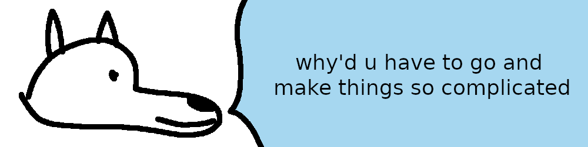

# **Linux Steam Runtime**

Rarely, certain native Linux games will require you to have a native Steam runtime running in order to launch.  Most Valve games will require this, as well as Shadow of Mordor and probably a couple others. This isn't exactly DRM, but it's something you'll need to fix if you want to play without Steam running.

I couldn't find any easily-accessible clean and native Linux versions of Valve games online, so we're going to compromise and walk through setting up Team Fortress 2 (hereafter referred to as `TF2` for my sanity) with a local Steam runtime. TF2 is free to download, so all you need is a Steam account in order to download a copy for our usage. Its only protection is Steamworks API.

1. Source the native Linux version of TF2 and extract it to your workspace

2. Defeat [Steamworks API](../../DRM/Steamworks-API/defeating_steamworks.md) protection

3. Copy [runtime-installer.sh](runtime-installer.sh) to the TF2 directory as `runtime-installer.sh`, and make it executable

4. Open a terminal in the TF2 directory and run: `./runtime-installer.sh tf.sh`. In this case, `tf.sh` is the normal executable you use to start the game. This will download the Steam runtime and set up a new executable for you to use, named `start-runtime.sh`

5. Open `start-runtime.sh` in a text editor. This is where you add arguments to use while launching the game. Valve games require a few of these in order to start correctly. You should generally be able to figure these out by looking at the original executable's launch parameters and by referencing [Valve's documentation](https://developer.valvesoftware.com/wiki/Command_Line_Options). You can also check SteamDB's "Configuration" section on a game for the parameters, e.g. [for TF2](https://steamdb.info/app/440/config/). Note that there must be a `"--"` between the executable and your arguments. Here are the ones I have recorded:

    **Counter-Strike: Global Offensive:**

    `-vulkan` may or may not be needed anymore

    `-novid` will skip startup videos

    ```bash
    "./SteamLinuxRuntime_sniper/run" "./csgo.sh" "--" "-steam" "-vulkan"
    ```

    **Counter-Strike: 2:**

    `-vulkan` may or may not be needed anymore

    `-novid` will skip startup videos

    ```bash
    "./SteamLinuxRuntime_sniper/run" "./cs2.sh" "--" "-steam" "-vulkan"
    ```

    **Left 4 Dead 2:**

    `-vulkan` may or may not be needed anymore

    `-novid` will skip startup videos

    ```bash
    "./SteamLinuxRuntime_sniper/run" "./hl2.sh" "--" "-game" "left4dead2" "-steam" "-vulkan"
    ```

    **Portal:**

    `-vulkan` may or may not be needed anymore

    `-novid` will skip startup videos

    ```bash
    "./SteamLinuxRuntime_sniper/run" "./hl2.sh" "--" "-game" "portal" "-steam" "-vulkan"
    ```

    **Portal 2:**

    `-vulkan` may or may not crash the game (they've been updating it recently)

    `-novid` will skip startup videos

    ```bash
    "./SteamLinuxRuntime_sniper/run" "./portal2.sh" "--" "-game" "portal2" "-steam" "-vulkan"
    ```

    **Team Fortress 2:**

    `-vulkan` uses new Vulkan renderer. Without this argument my TF2 launches to a black screen.

    `-novid` will skip startup videos

    ```bash
    "./SteamLinuxRuntime_sniper/run" "./tf.sh" "--" "-steam" "-vulkan"
    ```

6. Edit `start-runtime.sh` to match the TF2 line above

7. Start the game using `./start-runtime.sh`

