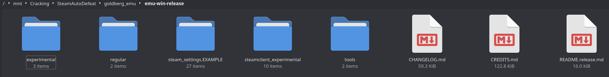
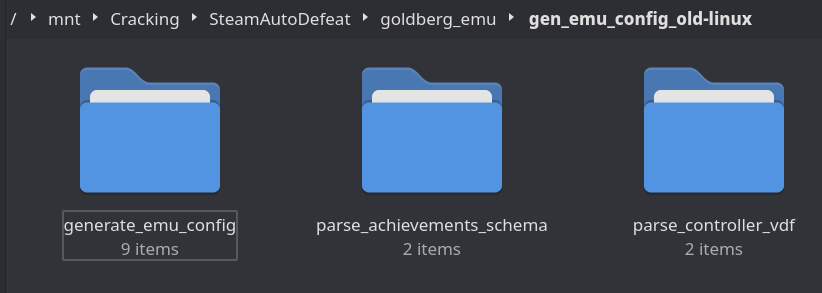

# **SteamAutoDefeat**

Steamworks API is the most common form of protection you'll encounter, so I wrote a script to help automate cracking it, along with SteamDRM/SteamStub. Windows users have many programs for this, but I didn't see any for Linux. This will allow you to automatically install and configure the 2nd-gen Goldberg Steam Emulator with as little effort as possible. The next steps will set up a small automated environment that can wrap around a few tools and cut down the work we need to do in the future.

1. Create an empty directory in your cracking toolkit and name it `SteamAutoDefeat`.

2. Copy the [SteamAutoDefeat.sh](./SteamAutoDefeat.sh) file into this directory, and make sure it's set to executable (via `chmod +x`/etc)

3. Create another directory under `SteamAutoDefeat` named `goldberg_emu` (i.e, `SteamAutoDefeat/goldberg_emu`)

4. Pull the archives from the [latest Goldberg Steam Emulator release](https://github.com/Detanup01/gbe_fork/releases) - specifically, we want `emu-win-release`, `emu-linux-release`, and `generate_emu_config-linux`

5. Unpack these archives so that your file structure looks like this:

    
    
    

6. Edit the `SteamAutoDefeat.sh` file:
    - If you want to hardcode your login credentials, store them in the `SAD_STEAM_USERNAME` and `SAD_STEAM_PASSWORD` variables. If not, it will ask every time
    - Change `SAD_STEAMLESS_CLI_EXE` to the location of the [Steamless](../../DRM/SteamDRM-Windows/defeating_steamdrm_windows.md) executable within your toolkit.
    - Set `SAD_STEAMLESS_WINE_PREFIX` to the Wine prefix that you want to run Steamless in, or leave it blank to use the system prefix. (Remember that you need to run `winetricks -q -f dotnet48` in whichever Wine prefix before Steamless can use it)
    - Change the rest of the options as desired

7. Now SteamAutoDefeat is ready to run and strip SteamDRM/SteamStub and Steamworks API from any game that it is pointed at.

8. Next, we're going to use it on a clean copy of Dead Cells, which has both SteamDRM and Steamworks API protection. This game can be sourced via cs.rin's SCS (thread ID `83054`).

9. Navigate to your `SteamAutoDefeat` directory and run the following command: `./SteamAutoDefeat.sh <STEAM_ID> /path/to/your/game/root/dir`. For Dead Cells, we'll use: `./SteamAutoDefeat.sh 588650 "/mnt/Cracking/Dead Cells"`

    

10. As we can see, it detected a `steam_api.dll` in the root path of the game, and it also detected that the game's executables were packed with SteamDRM. SAD can detect and unpack at every folder depth; it just so happens that Dead Cell's files are in the root. At this point, SAD has generated a potential crack that can be copied into the game's directory, but hasn't applied it yet. It's currently storing it in your designated `SAD_OUTPUT_PATH` location. I've set my `SAD_OUTPUT_PATH` to a non-temp location, so we can look at the generated crack:

    (ignore the missing executable icons, that's a standard Dead Cells problem):
    

11. SAD copies a backup of all files it wants to replace to this output directory, along with the cracked/unpacked variants. SAD also generates the `steam_interfaces.txt` file automatically where needed, and extracts the configuration generator's output into the right places. Finally, it also applies a few common personal configurations from your settings at the top of the `SteamAutoDefeat.sh` file into the `steam_settings` section.

12. The next prompt asks if you want to copy the crack into the original base game directory. If you say yes, it will copy the contents of this output over top of the original files. This isn't entirely destructive, as every conflict will have a `.bak` file copied along with it. You can also choose not to - this would be a useful option if you only want to generate a crack, e.g. for storage.

13. Afterwards, it will ask to clean up the `SAD_OUTPUT_PATH` directory. This removes all remaining generated parts for the current game from your output path.

14. If you chose to copy the crack over automatically, the game is now ready to play. Otherwise, copy the generated pieces over when ready.

15. For ease of use, I recommend putting the following code at the end of your `.bashrc`/`.zshrc`/etc and restarting your terminal. This allows you to use `SteamAutoDefeat.sh` from any location. (Use a different alias if `sad` conflicts with a program you already have)

    ```bash
    alias sad="/path/to/SteamAutoDefeat/SteamAutoDefeat.sh"
    ```

16. We can also run SAD in "Detect Mode". This will search throughout the game directory to find any Steamworks API files laying around, which is handy if you aren't sure what protection a game uses yet:

    

16. SteamDRM and Steamworks API games can now be cracked in a single command: `sad STEAM_ID path/to/game/dir`. Steamworks API is by far the DRM you'll encounter the most, so it pays to cut down on the time you spend repeating the work.


